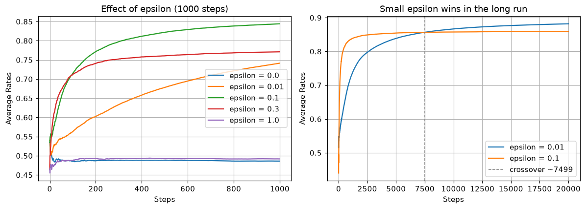
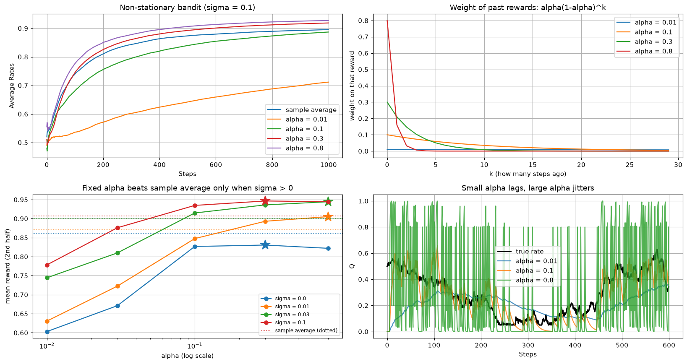

# CHAPTER 1 밴디트 문제
## 1.1 머신러닝 부류의 강화 학습
### 1.1.1 지도 학습
- supervised learning
- 입력과 출력을 쌍으로 묶은 데이터로 학습
- **정답 레이블**이 존재
- 
### 1.1.2 비지도 학습
- unsupervised learning
- **정답 레이블이 없음**
- 데이터에 숨어 있는 구조나 패턴을 찾는 용도
- 군집화(클러스터링), 특성 추출, 차원 축소 등
- 
### 1.1.3 강화 학습
- reinforcement learning
- 
- **에이전트**가 **환경**에서 **행동**하고, 환경은 **보상**과 **상태**를 돌려줌
- 정답 레이블 대신 **보상**이라는 신호를 단서로 학습
- 보상 총합을 최대화하는 행동 방식(정책)을 스스로 찾는 것이 목표
- 
## 1.2 밴디트 문제
### 1.2.1 밴디트 문제란?
- 여러 대의 슬롯머신 중 무엇을 플레이할지 고르는 문제
- 슬롯머신을 뜻하는 속어 `one-armed bandit`(외팔이 강도)에서 온 이름
  - 여러 대를 다루므로 **멀티암드 밴디트**(multi-armed bandit) 문제라고도 함
- 슬롯머신마다 코인이 나올 확률(승률)이 다르지만 플레이어는 그 값을 **모름**
- 정해진 횟수 안에 얻는 **보상의 총합**을 최대로 만드는 것이 목표
- 
- 강화 학습 문제 중 가장 단순한 형태
  - 에이전트가 행동해도 **환경의 상태가 변하지 않음**(늘 같은 상태)
  - 즉, 상태를 고려하지 않고 '어떤 행동이 좋은가'만 생각하면 됨
  - 그래서 그림 1-6에는 상태 화살표가 없고, 행동과 보상만 오감(상태가 있는 그림 1-4와 비교)
- 정리
  - 환경 : 슬롯머신
  - 에이전트 : 플레이어
  - 행동 : 슬롯머신 선택
  - 보상 : 코인
  - 상태 : **없음**(항상 같다고 봄) — 그림 1-6에 상태 화살표가 없는 이유
    - 각 슬롯머신의 승률은 환경이 감춰둔 값일 뿐, 에이전트가 받아 보는 상태가 아님
    - 1.5절에서 그 승률이 변하더라도 에이전트에게 오는 것은 여전히 보상뿐임
### 1.2.2 좋은 슬롯머신이란?
- 슬롯머신마다 얻을 수 있는 코인 개수의 **확률분포**가 정해져 있음
- 
- 좋은 슬롯머신 = 보상의 **기댓값**(expected value)이 큰 슬롯머신
  - 슬롯머신 a: `0×0.70 + 1×0.15 + 5×0.12 + 10×0.03 = 1.05`
  - 슬롯머신 b: `0×0.50 + 1×0.40 + 5×0.09 + 10×0.01 = 0.95`
  - → 기댓값이 큰 a가 더 좋은 슬롯머신
- 하지만 플레이어는 확률분포를 모르므로 **실제로 플레이한 결과**로 추정해야 함
- 
  - 한 번씩만 플레이한 결과(a=0, b=1). 이것만 보면 b가 좋아 보임
- 
  - a는 `(0+1+5)/3 = 2.0`, b는 `(1+0+0)/3 = 0.33`
- 플레이 횟수를 늘릴수록 **표본 평균**이 기댓값(참값)에 가까워짐
### 1.2.3 수식으로 표현하기
- 보상을 확률 변수 `R`, 행동을 `A`로 표기
- **행동 가치**(action value): 행동 `A`를 취했을 때 받는 보상의 기댓값
  - `q(A) = E[R | A]`
  - 예) `q(a) = 1.05`, `q(b) = 0.95`, `q(a) = E[R | A = a]`
- 즉, 밴디트 문제는 **가치가 가장 큰 행동을 찾는 문제**
- 다만 에이전트는 `q(A)`를 모르므로 **추정치 `Q(A)`** 를 만들어 써야 함
  - **소문자 `q`** = 환경이 갖고 있는 **참값**, **대문자 `Q`** = 에이전트가 짐작한 **추정치**
  - 학습이란 결국 `Q(A)`를 `q(A)`에 가깝게 만드는 일
- 용어 정리 — 이 문서에서는 다음 셋을 구분해서 씀
  |표기 |무엇 |어떻게 정해지나 |누가 아나 |
  |:--|:--|:--|:--|
  |**참값** `q(A)` |행동 가치의 실제 값(= 진짜 승률) |환경이 처음부터 갖고 있는 값 |환경만 |
  |**추정치** `Q(A)` |에이전트가 짐작한 값 |받은 보상으로 계산 |에이전트 |
  |**관측 승률** |실제로 이긴 비율 |`보상 총합 ÷ 플레이 횟수` |둘 다 |
  - 뒤에 나올 구현에서는 보상이 `0`(꽝) 또는 `1`(당첨)뿐이므로 `q(A) = E[R|A] = P(R=1|A)`
  - 즉 **행동 가치의 참값 `q(A)`가 곧 그 슬롯머신의 진짜 승률**이라서 두 말을 섞어 씀
## 1.3 밴디트 알고리즘
### 1.3.1 가치 추정 방법
- 실제로 플레이해서 얻은 보상들의 **표본 평균**으로 행동 가치를 추정
- 
  - `Q_n`: n번 플레이한 후의 가치 추정치(= `q`를 짐작한 값)
  - `R_i`: i번째 플레이에서 받은 보상
- 시도 횟수 `n`이 커질수록 추정치 `Q_n`은 참값 `q`(기댓값)에 수렴
### 1.3.2 평균을 구하는 코드
- 단순하게 구현하면 보상을 모두 저장해두고 매번 전체 합을 다시 계산
  - 메모리와 계산량이 플레이 횟수 `n`에 비례해 늘어남 → 비효율적
- **증분 구현**(incremental implementation)으로 개선 가능
- 
- 
- 
  - 이전 추정치 `Q_{n-1}`과 새로 받은 보상 `R_n`만 있으면 갱신 가능
  - 보상을 저장할 필요가 없고, 계산량도 매번 일정
- 
  - 증분 식 [식 1.5]가 수직선 위에서 "R 쪽으로 1/n 만큼 이동"임을 보여주는 그림
  - `n`이 커질수록 주황 화살표가 짧아짐 → 갱신이 점점 둔해짐
- 
  - 코드에서는 `Q = Q + (reward - Q) / n` 한 줄로 표현
- 예제 코드: [`s01_avg.py`](s01_avg.py) — 기본 구현과 증분 구현의 결과가 같음을 확인
### 1.3.3 플레이어의 정책
- **탐욕 정책**(greedy policy): 추정치 `Q`가 가장 큰 행동을 선택
  - 지금까지 얻은 정보를 최대한 써먹는 **활용**(exploitation)
  - 추정치는 부정확할 수 있어서, 잘못 추정된 슬롯머신에 계속 갇힐 위험이 있음
- **탐색**(exploration): 추정치와 무관하게 다른 슬롯머신도 시도해 정보를 모음
  - 당장의 보상은 손해지만 추정치의 정확도가 올라감
- 활용과 탐색은 **상충 관계**(trade-off) — 한쪽을 늘리면 다른 쪽이 줄어듦
- **ε-탐욕 정책**(ε-greedy policy): 둘을 확률로 섞는 가장 단순한 절충안
  - 확률 `ε`로 무작위 행동(탐색)
  - 확률 `1-ε`로 추정치가 최대인 행동(활용)
  - 예) `ε = 0.1`이면 10번 중 1번은 무작위로 플레이
## 1.4 밴디트 알고리즘 구현
### 1.4.1 슬롯머신 구현
- `Bandit` 클래스 — 환경 역할
  - `rates`: 슬롯머신 각각의 승률(0~1 사이 무작위값)로 초기화
  - `play(arm)`: `arm`번째 플레이해 `rate`의 확률로 `1`, 아니면 `0`을 반환
- **`self.rates[arm]`이 1.2.3에서 말한 참값 `q(A)`**(= 그 슬롯머신의 진짜 승률)
  - `Bandit()`을 만드는 순간 10개가 정해지고, 그 판이 끝날 때까지 바뀌지 않음(정상 문제)
  - 데이터로 계산한 값이 아니라 환경이 처음부터 갖고 있는 값이며, 에이전트는 이 배열을 볼 수 없음
  - 에이전트에게 주는 것은 오직 `0`/`1` 보상뿐이고, 그것만으로 `rates`(= `q`)를 짐작한 `Qs`(= `Q`)를 만들어야 함
  - `Bandit()`을 새로 만들 때마다 다시 뽑히므로 **실험마다 문제(와 난이도)가 달라짐**
  - 참값 `q`를 우리가 알고 있는 건 이것이 시뮬레이션이기 때문 — 덕분에 `|Q - q|` 같은 추정 오차를 잴 수 있음
```python
class Bandit:
    def __init__(self, arms=10):  # arms = 슬롯머신 대수
        self.rates = np.random.rand(arms)  # 슬롯머신 각각의 승률 설정(무작위) = 참값 q

    def play(self, arm):
        rate = self.rates[arm]
        if rate > np.random.rand():
            return 1
        else:
            return 0
```
### 1.4.2 에이전트 구현
- `Agent` 클래스 — 플레이어 역할
  - `Qs`: 각 슬롯머신의 가치 추정치, `ns`: 각 슬롯머신을 플레이한 횟수
  - `update()`: [식 1.5]의 증분 구현으로 추정치 갱신
  - `get_action()`: ε-탐욕 정책으로 행동 선택
```python
class Agent:
    def __init__(self, epsilon, action_size=10):
        self.epsilon = epsilon  # 무작위로 행동할 확률(탐색 확률)
        self.Qs = np.zeros(action_size)  # 참값 q에 대한 추정치 Q
        self.ns = np.zeros(action_size)

    # 슬롯머신의 가치 추정
    def update(self, action, reward):
        self.ns[action] += 1
        self.Qs[action] += (reward - self.Qs[action]) / self.ns[action]

    # 행동 선택(ε-탐욕 정책)
    def get_action(self):
        if np.random.rand() < self.epsilon:
            return np.random.randint(0, len(self.Qs))  # 무작위 행동 선택
        return np.argmax(self.Qs)  # 탐욕 행동 선택
```
### 1.4.3 실행해보기
- 예제 코드: [`s02_bandit.py`](s02_bandit.py) — 슬롯머신 10대, `ε=0.1`, 1,000 스텝
- 한 스텝의 흐름: 행동 선택 → 플레이하여 보상 획득 → 추정치 갱신
- 
  - **축**: x = 걸음 수, y = 그때까지 받은 **보상 총합**(코인 개수)
  - **볼 곳**: 선의 **기울기**. 기울기가 곧 승률이라 처음에는 완만하다가 점점 가팔라짐
  - 120걸음 부근에서 한 번 꺾인 뒤로는 거의 직선 → 좋은 슬롯머신을 찾아 계속 당기고 있다는 뜻
- 
  - 위 그림의 기울기를 그대로 그린 것(누적보상 ÷ 걸음 수)
  - **축**: x = 걸음 수, y = 그때까지의 **평균 승률**
  - **볼 곳**: 왼쪽 끝의 심한 출렁임과, 오른쪽으로 갈수록 잦아드는 모습
  - 120걸음 부근까지는 표본이 적어 `0.2~0.4` 사이에서 크게 튐
  - 이후 꾸준히 올라 600걸음 무렵 `0.8`을 넘어서고, 그 뒤로는 완만하게 안정됨
- 단, 슬롯머신의 승률과 플레이 결과 모두 무작위라 **실행할 때마다 결과가 달라짐**
### 1.4.4 알고리즘의 평균적인 특성
- 
  - **요약**: 같은 알고리즘을 10번 돌린 결과 — 실험마다 이렇게 다르다
  - **볼 곳**: 1000걸음 시점(오른쪽 끝)에서 선들이 **세로로 벌어진 폭**
  - 같은 알고리즘인데도 0.6대부터 0.95까지 흩어짐 → 슬롯머신의 승률이 실험마다 다르게 뽑히기 때문
  - 즉 한 번의 결과로는 알고리즘의 성능을 판단할 수 없음
- 여러 번 실험하고 **각 단계별로 평균**을 내면 알고리즘의 평균적인 특성이 드러남
- 
  - **볼 곳**: 빨간 화살표의 방향. 가로(한 실험의 시간축)가 아니라 **세로(같은 걸음 수끼리)** 로 평균
  - 1걸음 시점은 1걸음 시점끼리, 1000걸음 시점은 1000걸음 시점끼리 묶음
- 예제 코드: [`s03_bandit_avg.py`](s03_bandit_avg.py) — 200번 실험 후 단계별 평균
  - `all_rates`는 `(200, 1000)` 형상의 배열, `np.average(all_rates, axis=0)`로 평균
- 
  - **볼 곳**: 그림 1-13과 비교했을 때 사라진 **출렁임**. 200번을 평균 내 매끄러운 곡선이 됨
  - y축이 0.5에서 시작 → 아무것도 모르는 상태에서는 무작위로 고른 것과 같음
  - 이 곡선이 이 알고리즘의 '평균적인 실력'
- 
  - **요약**: `ε`를 3가지로 바꿔 비교 — 큰 `ε`는 빨리 오르고, 작은 `ε`는 나중에 앞선다
  - **축**: x = 걸음 수, y = 200번 실험 평균 승률. 선 3개는 각각 다른 `ε`
  - **볼 곳**: 150걸음 부근에서 파란 선(0.1)이 주황 선(0.3)을 **추월하는 교차점**
  - 교차점 왼쪽: `ε=0.3`이 앞섬 → 탐색을 많이 할수록 좋은 슬롯머신을 빨리 찾음
  - 교차점 오른쪽: `ε=0.1`이 앞섬 → 다 찾은 뒤에도 30%씩 딴 데를 당기는 비용이 쌓임
  - 초록 선(0.01)은 1000걸음 내내 오르는 중 → 아직 학습이 끝나지 않음(뒤에서 다시 다룸)
- 보충 예제: [`s04_epsilon_comparison.py`](s04_epsilon_comparison.py) — `ε`를 0부터 1까지 바꿔가며 비교
  - `np.random.seed(0)`으로 시드를 고정해두어 아래 그림과 숫자는 그대로 재현됨
- 
  - **왼쪽 그림**(1,000걸음): 위아래로 갈라진 **두 무리**를 봄
    - 바닥에 깔린 두 선이 `ε=0`과 `ε=1`(둘 다 0.49 근처) → 한쪽만 극단적으로 쓰면 출발선에서 못 벗어남
    - 위쪽 세 선(`ε`=0.1/0.3/0.01)은 계속 오르는 중 → 탐색과 활용을 섞어야 학습이 일어남
  - **오른쪽 그림**(20,000걸음): 두 선이 만나는 **회색 점선(교차점)** 을 봄
    - 1,000걸음까지는 `ε=0.1`이 압도적이지만, 약 7,500걸음에서 `ε=0.01`이 추월해 그대로 앞섬
## 1.5 비정상 문제
### 1.5.1 비정상 문제를 풀기 위해서
- **정상 문제**(stationary problem): 보상의 확률분포가 변하지 않는 문제
- **비정상 문제**(non-stationary problem): 시간이 지나면서 확률분포가 변하는 문제
  - 오래된 보상일수록 현재의 가치를 반영하지 못함 → 최근 보상을 더 중시해야 함
- 표본 평균은 모든 보상을 **똑같은 비중**으로 다룸
- 
  - **축**: x = 보상을 받은 순서(`R_1`이 가장 오래된 것), y = 그 보상이 `Q`에 반영되는 비중
  - **볼 곳**: 막대 높이가 전부 같음 → 1,000번째 보상과 첫 번째 보상의 발언권이 동일
  - 승률이 변하는 환경에서는 이미 낡은 `R_1`이 현재 추정치를 계속 붙잡고 있는 셈
- 갱신 폭 `1/n`을 **고정값 α**로 바꾸면 최근 보상에 더 큰 비중을 줄 수 있음
- 
- 
- 
- 
- 
  - 보상 `R_i`의 가중치가 `(1-α)`의 거듭제곱만큼 **지수적으로 감소**
  - 오래된 보상일수록 가중치가 작아지고, 초깃값 `Q_0`의 영향도 함께 사라짐
  - 이런 갱신 방식을 **지수 이동 평균**(exponential moving average)이라고 함
- 
  - **요약**: 고정값 `α`가 주는 비중 — 최근 보상에 몰아주고 과거는 빠르게 잊는다
  - **볼 곳**: 그림 1-18과 같은 축인데 막대가 **오른쪽으로 갈수록 높아짐**
  - 최근 보상(`R_n`, `R_{n-1}`)이 대부분의 비중을 차지하고, 오래된 보상은 거의 0에 수렴
  - 감소 속도를 정하는 것이 `α` — 이 손잡이를 어떻게 돌릴지는 [`s06_alpha_comparison.py`](s06_alpha_comparison.py)에서 다룸
### 1.5.2 비정상 문제 풀기
- `NonStatBandit` 클래스 — 플레이할 때마다 승률에 노이즈를 더해 환경이 변하게 만듦
  - `sigma`가 승률이 흔들리는 정도(환경의 변화 속도), `0`이면 정상 문제와 같아짐
```python
class NonStatBandit:
    def __init__(self, arms=10, sigma=0.1):
        self.arms = arms
        self.sigma = sigma
        self.rates = np.random.rand(arms)  # 각 슬롯머신의 참값 q

    def play(self, arm):
        rate = self.rates[arm]
        self.rates += self.sigma * np.random.randn(self.arms)  # 노이즈 추가
        if rate > np.random.rand():
            return 1
        else:
            return 0
```
- `AlphaAgent` 클래스 — `1/n` 대신 고정값 `α`로 추정치를 갱신
```python
class AlphaAgent:
    def __init__(self, epsilon, alpha, actions=10):
        self.epsilon = epsilon
        self.Qs = np.zeros(actions)  # 참값 q에 대한 추정치 Q
        self.alpha = alpha  # 고정값 α

    def update(self, action, reward):
        # α로 갱신
        self.Qs[action] += (reward - self.Qs[action]) * self.alpha
```
- 예제 코드: [`s05_non_stationary.py`](s05_non_stationary.py) — 표본 평균 방식과 고정값 `α` 방식을 비교
- 
  - **요약**: 비정상 문제에서 표본 평균과 `α=0.8`의 성적 비교 — 고정값 `α`가 앞선다
  - **축**: x = 걸음 수, y = 200번 실험 평균 승률. 두 선은 표본 평균 방식과 `α=0.8` 방식
  - **볼 곳**: 두 선이 갈라지기 시작하는 **200걸음 부근**과, 오른쪽 끝의 벌어진 간격
  - 초반에는 거의 겹침 → 표본 평균도 `n`이 작을 때는 갱신 폭 `1/n`이 커서 잘 따라감
  - 갈수록 벌어짐 → `n`이 커지며 `1/n`이 0에 가까워져 표본 평균은 사실상 학습을 멈춤
  - 단, 이 그림은 `σ=0.1` 한 가지 환경의 결과임에 주의(아래 보충 예제에서 확인)
- 보충 예제: [`s06_alpha_comparison.py`](s06_alpha_comparison.py) — `α`값과 환경 변화 속도(`σ`)에 따른 차이 비교
  - `np.random.seed(0)`으로 시드를 고정해두어 아래 그림과 숫자는 그대로 재현됨
- 
  - **왼쪽 위** — `σ=0.1`인 비정상 문제에서 다섯 에이전트가 받은 성적표
    - **볼 곳**: 맨 아래에 홀로 떨어진 `α=0.01` 선. 나머지 넷은 비슷하게 붙어 있음
    - 빠르게 변하는 환경에서는 기억이 너무 길면 손해라는 뜻
  - **오른쪽 위** — `α`가 과거 보상에 주는 비중이 얼마나 빨리 줄어드는지(그림 1-19의 수치판)
    - **볼 곳**: `k=0` 지점의 높이와 **0에 닿는 위치**
    - `α=0.8`은 0.8에서 시작해 3걸음이면 0에 수렴 → 사실상 최근 2~3번만 기억
    - `α=0.01`은 0.01에서 시작해 30걸음까지 거의 평평(0.0100 → 0.0075) → 그림 1-18(표본 평균)에 가까움
  - **왼쪽 아래** — 환경의 변화 속도(`σ`)가 달라지면 최적의 `α`도 달라진다는 것
    - 아래 표를 그림으로 옮긴 것이라 해석은 표 쪽에 정리
    - x축이 시간이 아니라 **`α`(로그 스케일)**, 점선은 그 `σ`에서 표본 평균이 낸 점수
    - **볼 곳**: 실선이 **같은 색 점선**을 넘는지 여부. 색이 다르면 환경이 다르므로 색끼리 비교 금지
  - **오른쪽 아래** — 성적이 아니라 **추정 실력**을 보는 그림. 참값 `q`(검은 선)를 `α`별 추정치 `Q`가 얼마나 잘 쫓아가나
    - 앞의 세 패널과 달리 **슬롯머신 한 대만 떼어낸 별도 데모**
    - 선택(`argmax`·`ε`)을 빼고 매 걸음 그 한 대를 당기며, 세 `α`가 **똑같은 보상 열**을 받음 → 차이는 오직 `α` 때문
    - `σ=0.02`로 낮추고 참값 `q`를 `[0.05, 0.95]`로 잘라둠 — 안 그러면 검은 선이 1을 넘어 화면을 벗어남
    - **볼 곳**: 검은 선과 각 색 선의 **간격과 떨림**. 특히 `q`가 0.05까지 떨어지는 250~350걸음 구간
    - `α=0.01`(파랑)은 검은 선이 꺾여도 한참 뒤에 따라감 → 느리지만 매끄러움
    - `α=0.8`(초록)은 0과 1 사이를 마구 오감 → 빠르지만 한 번의 보상에 통째로 휘둘림
    - `α=0.1`(주황)이 그 중간
- 왼쪽 아래 그림을 숫자로 옮긴 콘솔 출력
  ```
  sigma별 정상 구간 평균 보상 (클수록 좋음)
  --------------------------------------------------------------------
  sigma        a=0.01   a=0.03    a=0.1    a=0.3    a=0.8   sample avg
  --------------------------------------------------------------------
  0.0        0.6031   0.6712   0.8268   0.8305 * 0.8220         0.8612
  0.01       0.6306   0.7226   0.8475   0.8931   0.9052 *       0.8703
  0.03       0.7445   0.8099   0.9148   0.9361   0.9444 *       0.9000
  0.1        0.7784   0.8760   0.9347   0.9464 * 0.9445         0.9069
  --------------------------------------------------------------------
  (* 는 그 행에서 승률이 가장 높은 α)
  ```
  - **볼 곳**: 각 행에서 `*`(그 행의 1위)와 맨 오른쪽 `sample avg` 열의 **대소 관계**
    - 첫 행(`σ=0.0`)만 `sample avg`가 더 큼 → 승률이 변하지 않으면 표본 평균이 이김
    - 나머지 행은 `*`가 더 큼 → 세상이 변해야 고정값 `α`가 이김. 1.5.2의 결과도 `α`가 커서가 아니라 `σ=0.1` 환경이었기 때문
  - 오른쪽 세 열(`α`=0.1/0.3/0.8)이 거의 붙어 있음 → **승률로는 `α`의 우열을 못 가림**
    - `ε` 때문에 **성능 상한**이 낮게 걸려 있고, `α`가 0.1만 넘으면 이미 거기에 붙기 때문
    - 행동은 `argmax`라 `Q`의 **순위**만 맞으면 `Q`가 부정확해도 받는 보상은 같음
    - `α`를 고르려면 `|Q - q|`(1.4.1) 같은 추정 오차를 재야 함 — 참값 `q`를 아는 시뮬레이션에서만 가능
  - 그 성능 상한을 실제로 재본 콘솔 출력
    ```
    sigma별 성능 상한(참값 q를 아는 경우)과 위 표의 1위 비교
      sigma 0.0    상한 0.8627 | 1위 a=0.3   0.8305 (상한까지 -0.0322)
      sigma 0.01   상한 0.9092 | 1위 a=0.8   0.9052 (상한까지 -0.0039)
      sigma 0.03   상한 0.9449 | 1위 a=0.8   0.9444 (상한까지 -0.0005)
      sigma 0.1    상한 0.9474 | 1위 a=0.3   0.9464 (상한까지 -0.0009)
    ```
    - **상한** = 추정치 `Q` 대신 **참값 `q`를 그대로 보고** 고르는 에이전트의 점수. 위 표와 조건이 모두 같음
    - `q`를 다 아는데도 `1`이 안 되는 이유는 `ε=0.1`로 10번 중 1번은 무작위로 당기기 때문
    - **볼 곳**: 맨 오른쪽 `상한까지` 값. `σ>0`인 세 행은 `-0.001` 안팎 → 1위 `α`는 이미 상한에 닿아 있음
    - 그래서 그 위로는 승률에 차이가 날 자리가 없음 — 오른쪽 세 열이 붙어 있는 것은 `α`들이 비슷해서가 아니라 **잣대가 천장에 막혀서**
  - 행끼리 비교 금지 — `σ`가 크면 승률이 1을 넘는 슬롯머신이 생겨 점수의 상한 자체가 올라감(위 상한 값도 행마다 다름)
## 1.6 정리
- 강화 학습은 **에이전트와 환경의 상호작용**에서 얻는 **보상**을 단서로 학습
- **밴디트 문제**는 상태가 늘 같은(사실상 상태가 없는) 가장 단순한 강화 학습 문제
  - 1.5절의 비정상 문제도 환경이 감춘 승률이 변할 뿐, 에이전트가 받는 것은 여전히 보상뿐
- 좋은 슬롯머신은 보상의 **기댓값**(= 행동 가치 `q(A) = E[R|A]`)이 큰 슬롯머신
- 에이전트는 `q`를 모르므로 **추정치 `Q`** 를 만들어 씀(소문자 `q` = 참값, 대문자 `Q` = 추정치)
- 가치는 실제 플레이 결과의 **표본 평균**으로 추정하며, **증분 구현**으로 효율화
  - `Q_n = Q_{n-1} + (1/n)(R_n - Q_{n-1})`
- 정책은 **활용과 탐색**의 균형이 핵심이며, **ε-탐욕 정책**이 대표적인 절충안
- **비정상 문제**에서는 갱신 폭을 **고정값 α**로 두어 최근 보상을 더 중시
  - `Q_n = Q_{n-1} + α(R_n - Q_{n-1})`
- 다음 장에서는 **상태가 변하는** 문제(마르코프 결정 과정)로 확장
