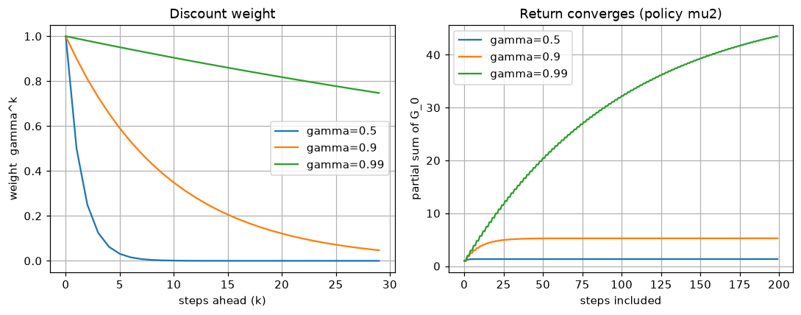

# CHAPTER 2 마르코프 결정 과정
## 2.1 마르코프 결정 과정(MDP)이란?
- **마르코프 결정 과정**(Markov Decision Process) — 에이전트의 행동에 따라 **상태가 변하는** 문제
- 1장의 밴디트 문제와의 차이
  - 밴디트: 어떤 슬롯머신을 당겨도 다음에 마주하는 상황은 늘 같음 → **상태가 없음**
  - MDP: 내가 한 행동이 다음에 마주할 상황을 바꿈 → **지금의 행동이 미래의 보상까지 좌우함**
- 그래서 MDP에서는 '지금 받을 보상'이 아니라 **'앞으로 받을 보상의 총합'** 을 기준으로 행동해야 함
### 2.1.1 구체적인 예
- 
  - 칸이 다섯 개인 1차원 **그리드 월드**. 에이전트는 한 걸음에 왼쪽/오른쪽 한 칸씩 이동
  - 왼쪽 끝에 사과(보상 `+1`), 오른쪽 끝에 폭탄(보상 `-2`), 에이전트는 한가운데
  - 이 그림만 보면 답은 뻔함 — 왼쪽으로 두 칸 가서 사과를 먹으면 됨
- 
  - **볼 곳**: 위에서 아래로 내려오는 **두 갈래**. 같은 자리에서 왼쪽을 고르느냐 오른쪽을 고르느냐에 따라
    두 걸음 뒤에 받는 보상이 `+1`과 `-2`로 갈림
  - 밴디트라면 한 번의 선택이 한 번의 보상으로 끝나지만, 여기서는 **선택이 다음 선택지를 바꿈**
- 
  - **요약**: 칸의 배치(= 환경)를 조금 바꾸면 최적 행동이 뒤집힌다는 것을 보여주는 그림
  - 왼쪽 끝에 사과(`+1`), 오른쪽에 폭탄(`-2`), **그 너머에 사과 여섯 개(`+6`)**
  - **볼 곳**: `-2`와 `+6`이 나란히 붙어 있는 오른쪽. 폭탄을 밟는 손해를 감수하고 지나가면
    `-2 + 6 = +4`로, 왼쪽 사과 `+1`보다 이득
  - 즉 **눈앞의 보상만 보면 틀림** — 앞으로 받을 보상을 모두 더해서 비교해야 함
  - 다만 `+6`은 `-2`보다 한 걸음 뒤에 오므로, 그것을 얼마나 값으로 쳐줄지에 따라 답이 달라짐
    - 그 판단을 맡는 것이 2.3.2의 할인율 `γ`이며, 이 세계의 경계는 `γ = 0.4`
      (0.4보다 작으면 왼쪽, 크면 오른쪽 — 자세한 계산은 [논문 5절](paper/ch02_mdp.pdf) 참고)
### 2.1.2 에이전트와 환경의 상호작용
- 
  - **볼 곳**: 환경에서 나오는 화살표가 **둘**이라는 점(보상 `R_t`와 다음 상태 `S_{t+1}`)
  - 1장의 그림 1-6에는 보상 화살표뿐이었음 → 여기서 처음으로 상태가 돌아옴
- 한 시간 단계 `t`의 흐름
  1. 에이전트는 상태 `S_t`를 보고 행동 `A_t`를 고름
  2. 환경은 보상 `R_t`를 주고, 상태를 `S_{t+1}`로 바꿈
  3. 시간을 하나 진행시켜 1로 돌아감
- 표기 약속 — 대문자는 **확률 변수**(`S_t`, `A_t`, `R_t`), 소문자는 **구체적인 값**(`s`, `a`, `r`)
- 이 장에서는 다음을 가정
  - 상태 전이는 **확률적**일 수 있음(같은 행동을 해도 결과가 갈릴 수 있음)
  - 보상은 `(s, a, s')`가 정해지면 **하나로 결정됨**(결정적 보상 함수)
## 2.2 환경과 에이전트를 수식으로
- MDP를 정의하려면 다섯 가지가 필요함 — 앞의 넷이 **환경**, 마지막이 **에이전트**
  |기호 |이름 |누구의 것 |
  |:--|:--|:--|
  |`S` |상태의 집합 |환경 |
  |`A` |행동의 집합 |환경 |
  |`p(s'\|s, a)` |상태 전이 확률 |환경 |
  |`r(s, a, s')` |보상 함수 |환경 |
  |`π(a\|s)` |정책 |에이전트 |
- 여기에 수익을 계산할 때 쓰는 **할인율 `γ`**(2.3.2)가 더해짐
- 예제 코드: [`s01_mdp.py`](s01_mdp.py) — 2.4절의 두 칸 그리드 월드를 위 항목대로 출력해봄
  ```
  S (상태 집합)  : ['L1', 'L2']
  A (행동 집합)  : ['Left', 'Right']
  gamma (할인율) : 0.9

  상태 전이 확률 p(s'|s, a) 와 보상 r(s, a, s')
  ----------------------------------------------------
      s       a ->    s'  p(s'|s,a)  r(s,a,s')
  ----------------------------------------------------
     L1    Left ->    L1        1.0       -1.0
     L1   Right ->    L2        1.0        1.0
     L2    Left ->    L1        1.0        0.0
     L2   Right ->    L2        1.0       -1.0
  ```
  - `p`가 전부 `1.0` → 이 환경은 **결정적**. 확률적 환경이라면 한 `(s, a)` 줄이 여러 개로 쪼개짐
### 2.2.1 상태 전이
- 
  - **볼 곳**: 왼쪽은 화살표가 **하나**, 오른쪽은 **둘로 갈라짐**
  - 왼쪽(**결정적 전이**): `Left`를 고르면 반드시 왼쪽 칸으로 감
  - 오른쪽(**확률적 전이**): `Left`를 골라도 0.9의 확률로 왼쪽, 0.1의 확률로 오른쪽으로 감
    - 바닥이 미끄럽다거나 하는 이유로 의도대로 되지 않는 상황
- 결정적 전이는 함수 하나로 충분: `s' = f(s, a)`
- 확률적 전이는 **상태 전이 확률**로 표현: `p(s' | s, a)`
- 
  - `L3`에서 `Left`를 골랐을 때의 `p(s'|s, a)` — `L2`가 0.9, `L3`(제자리)이 0.1, 나머지는 0
  - **볼 곳**: 표의 한 줄을 다 더하면 `1`이 됨. 확률분포이므로 당연한 성질
- **마르코프 성질**(Markov property) — 다음 상태가 **바로 직전의 상태와 행동**만으로 정해지는 성질
  - `p(s' | s, a)`에 `S_{t-1}`이나 `A_{t-3}` 같은 과거가 등장하지 않는다는 뜻
  - 왜 이렇게 두는가: 과거 전체를 조건에 넣으면 조합이 시간에 따라 **무한히 늘어남**
  - 대신 '필요한 정보는 모두 현재 상태에 담아둔다'고 약속함
    - 예) 속도가 중요하면 위치만이 아니라 `(위치, 속도)`를 하나의 상태로 정의
  - 이 성질을 만족하도록 문제를 세운 것이 곧 **마르코프** 결정 과정
### 2.2.2 보상 함수
- **보상 함수** `r(s, a, s')` — 상태 `s`에서 행동 `a`를 해서 `s'`에 도착했을 때 받는 보상
- 
  - `r(s=L2, a=Left, s'=L1) = 1` — 사과가 있는 `L1`로 이동했으므로 `+1`
  - **볼 곳**: 인수가 셋(`s`, `a`, `s'`)이라는 점. 어디서 출발했는지, 무엇을 했는지, 어디에 도착했는지를 모두 봄
- 이 장에서는 보상이 결정적이라고 가정 → 세 값이 정해지면 보상이 하나로 정해짐
  - 보상도 확률적인 경우는 기댓값 `E[R_t | s, a, s']`로 두면 이후 논의가 그대로 성립
- 보상은 **환경이 정하는 값**임에 주의 — 에이전트가 고를 수 있는 것이 아님
  - 그림 2-3에서 봤듯, 보상을 어떻게 배치하느냐가 곧 문제의 정답을 바꿈
### 2.2.3 에이전트의 정책
- **정책**(policy) — 에이전트가 상태를 보고 행동을 정하는 방식
- 
  - 왼쪽(**결정적 정책**): `L3`에서는 반드시 `Left`. 함수로 `μ(s)`로 씀 (`a = μ(s)`)
  - 오른쪽(**확률적 정책**): `L3`에서 `Left`를 0.4, `Right`를 0.6의 확률로 고름. `π(a|s)`로 씀
  - **볼 곳**: 오른쪽 괄호 안 숫자의 합이 `1` — 각 상태마다 행동에 대한 확률분포가 하나씩 있음
- 결정적 정책은 확률적 정책의 특수한 경우(한 행동의 확률이 1)이므로, 앞으로는 `π(a|s)`로 통일해 씀
- 정책이 **현재 상태만** 보고 행동을 정해도 되는 이유가 바로 마르코프 성질
  - 환경이 현재 상태만 보고 다음을 정하니, 에이전트도 과거를 기억할 필요가 없음
- 정리하면 MDP의 한 시간 단계는 이렇게 진행됨
  - 에이전트: `A_t ~ π(a | S_t)`
  - 환경: `S_{t+1} ~ p(s' | S_t, A_t)`, `R_t = r(S_t, A_t, S_{t+1})`
## 2.3 MDP의 목표
- 목표는 **최적 정책**을 찾는 것 — 여기서 '최적'이 무엇인지를 이 절에서 정의함
### 2.3.1 일회성 과제와 지속적 과제
- **일회성 과제**(episodic task): 끝이 있는 문제
  - 
    - `Goal`에 도달하면 한 판이 끝나고 처음부터 다시 시작
    - 한 판을 **에피소드**(episode)라고 부름
  - 예) 바둑(승패가 나면 끝), 미로 탈출
- **지속적 과제**(continuing task): 끝이 없이 계속되는 문제
  - 예) 재고 관리, 2.4절의 두 칸 그리드 월드(종료 상태가 없음)
- 구분이 중요한 이유: 끝이 없으면 보상을 **그냥 더할 수 없음**(무한대로 발산)
### 2.3.2 수익
- **수익**(return) `G_t` — 시각 `t` 이후로 받는 보상을 **할인해서** 모두 더한 값
- 
  - `G_t = R_t + γR_{t+1} + γ²R_{t+2} + ...`
  - `γ`는 **할인율**(discount rate)로 `0 ≤ γ ≤ 1`
- 할인율을 두는 이유 세 가지
  1. **발산 방지** — 지속적 과제에서도 `γ < 1`이면 등비급수라 유한한 값으로 수렴
  2. **가까운 미래 중시** — 100걸음 뒤의 사과보다 지금의 사과가 낫다는 상식을 반영
  3. **불확실성 반영** — 먼 미래일수록 예측이 어긋날 가능성이 큼
- 수식을 그대로 코드로 옮기면 **뒤에서부터 접어 올리는** 한 줄이 됨
  ```python
  def calc_return(rewards, gamma):
      G = 0.0
      for reward in reversed(rewards):
          G = reward + gamma * G   # G_t = R_t + γ·G_{t+1}
      return G
  ```
  - `G_t = R_t + γ G_{t+1}`라는 **재귀 구조**가 핵심 — 3장 벨만 방정식의 출발점
- 예제 코드: [`s01_mdp.py`](s01_mdp.py) — 정책 `μ = {L1: Right, L2: Left}`로 진행하며 수익을 계산
  ```
  t=0  S_t=L1  A_t=Right  R_t=+1.0
  t=1  S_t=L2  A_t=Left   R_t=+0.0
  t=2  S_t=L1  A_t=Right  R_t=+1.0
  ...
  걸음 수를 늘리면 수익 G_0 는 하나의 값으로 수렴한다.
    steps=1    G_0 = 1.000000
    steps=2    G_0 = 1.000000
    steps=5    G_0 = 2.466100
    steps=10   G_0 = 3.428008
    steps=50   G_0 = 5.236033
    steps=100  G_0 = 5.263018
    steps=500  G_0 = 5.263158
  ```
  - **볼 곳**: 걸음 수를 늘려도 `5.263158`에서 더 이상 움직이지 않음
  - 보상은 끝없이 들어오는데 합이 멈추는 이유가 `γ^k`가 0으로 수렴하기 때문
  - 참값은 `1/(1-γ²) = 1/0.19 = 5.2631...` — 50걸음에서 오차 `0.027`, 100걸음에서 `0.00014`
- 보충 예제: [`s02_discount.py`](s02_discount.py) — `γ`를 바꿔가며 수익을 비교
  - 정책 이름과 번호는 2.4.2의 그림 2-16을 따름 — `μ1`=(Right, Right), `μ2`=(Right, Left)
  ```
  gamma에 따른 수익 G_0 (시작 상태 L1)
  ----------------------------------------------------------
    gamma mu1 (L1:Right, L2:Right)  mu2 (L1:Right, L2:Left)
  ----------------------------------------------------------
     0.00                   1.0000                   1.0000
     0.30                   0.5714                   1.0989
     0.50                   0.0000                   1.3333
     0.70                  -1.3333                   1.9608
     0.90                  -8.0000                   5.2632
     0.99                 -97.9957                  50.2491
  ```
  - **볼 곳**: 맨 윗줄(`γ=0`)에서 두 정책의 점수가 `1.0000`으로 **같다는** 것
    - `γ=0`이면 `G_t = R_t` — 바로 다음 보상만 보므로 둘 다 '사과를 먹는다'로 똑같아 보임
    - `L2`에서 벽에 계속 부딪히는 `μ1`의 손해가 전혀 드러나지 않음
  - 아래로 내려갈수록 두 열의 차이가 벌어짐 → **`γ`가 커야 먼 미래의 손익이 점수에 반영됨**
  - 단, `γ`가 1에 가까우면 수익의 절댓값이 커지고 수렴도 느려짐(`γ=0.99`는 1,000걸음을 써도 여유가 없음)
- 
  - **왼쪽** — 할인 가중치 `γ^k` 자체를 그린 것
    - **축**: x = 몇 걸음 뒤인가(`k`), y = 그 보상에 곱해지는 가중치
    - **볼 곳**: 각 선이 **0에 닿는 위치**. `γ=0.5`는 10걸음이면 사실상 0,
      `γ=0.9`는 30걸음에도 0.04가 남고, `γ=0.99`는 30걸음까지 0.74로 거의 줄지 않음
    - 가중치의 총합 `1/(1-γ)`가 **에이전트가 사실상 몇 걸음 앞까지 내다보는지**를 나타냄
      (`γ=0.5`→2걸음, `γ=0.9`→10걸음, `γ=0.99`→100걸음)
    - 1장 그림 1-19(고정값 `α`의 지수 감소)와 같은 모양 — 쓰임은 다르지만 둘 다 등비 가중치
  - **오른쪽** — 수익의 부분합이 수렴하는 모습(정책 `μ2`)
    - **축**: x = 몇 걸음까지 더했는가, y = 거기까지의 부분합
    - **볼 곳**: 각 선이 **평평해지는 지점**. `γ=0.5`는 10걸음, `γ=0.9`는 100걸음 남짓이면 눕지만,
      `γ=0.99`는 200걸음에도 아직 오르는 중
    - 코드에서 `HORIZON=500`을 쓰는 이유가 여기 있음 — `0.9^500 ≈ 1e-23`이라 사실상 무한 걸음
### 2.3.3 상태 가치 함수
- 수익 `G_t`는 정책이 확률적이거나 전이가 확률적이면 **매번 값이 달라짐** → 하나의 숫자로 쓸 수 없음
- 그래서 **기댓값**을 취함 — 이것이 **상태 가치 함수**(state-value function)
- 
- 
  - `v_π(s) = E_π[G_t | S_t = s]` — 상태 `s`에서 시작해 정책 `π`대로 행동할 때 얻는 수익의 기댓값
  - 아래첨자 `π`를 `E`에 붙여 조건부의 `π`를 생략한 것이 [식 2.3]. 같은 뜻
- 1장의 행동 가치 `q(A) = E[R | A]`와 비교하면 차이가 분명함
  |  |밴디트 (1장) |MDP (2장) |
  |:--|:--|:--|
  |무엇의 기댓값 |한 번의 보상 `R` |수익 `G_t`(보상의 할인 합) |
  |무엇에 대한 함수 |행동 `A` |상태 `s` |
  |정책의 영향 |없음(그 행동 한 번뿐) |있음 — 이후 모든 행동이 `π`를 따름 |
- 즉 `v_π(s)`는 **정책 `π`가 상태 `s`에서 받은 성적표**. 정책이 바뀌면 값도 바뀜
- 결정적 MDP에서는 기댓값을 취할 대상이 하나뿐이라 정의 그대로 계산하면 됨
  ```
  정책 mu의 상태 가치 함수 (500걸음 근사)
    v_mu(L1) = 5.2632
    v_mu(L2) = 4.7368
  ```
  - `L1`에서 시작하면 곧바로 사과(`+1`)를 먹고, `L2`에서 시작하면 한 걸음 늦게 먹기 시작
  - 그래서 `v(L2) = γ × v(L1) = 0.9 × 5.2632 = 4.7368`
### 2.3.4 최적 정책과 최적 가치 함수
- 두 정책 중 무엇이 나은지 어떻게 비교하는가? — 상태가 여러 개라 간단하지 않음
- 
  - **축**: x = 상태(`L1`~`L5`), y = 그 상태에서의 가치. 선 두 개가 정책 `π`와 `π'`
  - **볼 곳**: 두 선이 **여러 번 교차**한다는 것 — `L2`에서는 `π`가 낫고 `L5`에서는 `π'`가 나음
  - 이런 경우 둘 사이에 우열을 정할 수 없음(**부분 순서**)
- 
  - **볼 곳**: 이번에는 `π'`가 **모든 상태에서** `π` 이상(`L3`에서는 같음, 나머지는 위)
  - 이럴 때만 `π' ≥ π`라고 정의함 — 즉 **모든 상태에서 `v_π'(s) ≥ v_π(s)`**
- 
  - **볼 곳**: 주황색 `π*` 선이 **어느 상태에서도 다른 정책보다 아래에 있지 않음**
  - 이렇게 모든 정책보다 위에 있는(또는 같은) 정책이 **최적 정책** `π*`
  - `π1`~`π4`끼리는 서로 교차해도 상관없음 — 요구되는 것은 `π*`가 그 전부의 위에 있다는 것뿐
- MDP의 중요한 성질 — 어떤 MDP에도 **최적 정책이 적어도 하나 존재**하며,
  그중에는 **결정적 정책**이 반드시 있음
  - 부분 순서에서는 서로 비교 불가능한 것들만 남아 1등이 없을 수도 있는데,
    MDP에서는 그런 일이 생기지 않는다는 뜻
  - 덕분에 '상태마다 최선의 행동 하나를 고른 표'만 찾으면 됨
- **최적 가치 함수**: `v*(s) = max_π v_π(s)` — 최적 정책의 상태 가치 함수
- 이 성질을 코드로 확인해보면 ([`s03_policy_bruteforce.py`](s03_policy_bruteforce.py))
  ```python
  # 모든 상태에서 동시에 가장 좋은 정책이 존재한다는 것이 MDP의 중요한 성질이다.
  best_policy, best_values = max(results, key=lambda x: x[1]['L1'])
  assert all(best_values[s] >= values[s] for _, values in results for s in states), \
      '모든 상태에서 동시에 최적인 정책이 있어야 한다'
  ```
  - `L1` 기준으로만 1등을 뽑았는데 `L2`에서도 1등임을 `assert`로 확인
## 2.4 MDP 예제
- 
  - **두 칸짜리 그리드 월드** — 상태는 `L1`, `L2` 둘, 행동은 `Left`, `Right` 둘
  - `L2`에 사과가 있고, 먹으면 곧바로 다시 생김(그래서 끝이 없는 **지속적 과제**)
  - 양옆은 벽 — 벽 쪽으로 가면 제자리에 머물고 `-1`
- 보상 규칙 정리 (`γ = 0.9`)
  |`s` |`a` |`s'` |`r` |설명 |
  |:--|:--|:--|--:|:--|
  |`L1` |Left |`L1` |`-1` |벽에 부딪힘 |
  |`L1` |Right |`L2` |`+1` |사과를 먹음 |
  |`L2` |Left |`L1` |`0` |그냥 이동 |
  |`L2` |Right |`L2` |`-1` |벽에 부딪힘 |
- 환경 구현: [`../common/two_square_grid.py`](../common/two_square_grid.py) — `TwoSquareGrid` 클래스
  ```python
  def next_state(self, state, action):
      """상태 전이 함수 (결정적이므로 다음 상태를 하나만 반환)"""
      if state == 'L1':
          return 'L1' if action == 0 else 'L2'   # Left는 벽, Right는 L2로
      else:
          return 'L1' if action == 0 else 'L2'   # Left는 L1으로, Right는 벽

  def reward(self, state, action, next_state):
      """보상 함수 r(s, a, s')"""
      if state == next_state:   # 벽에 부딪혀 제자리
          return -1.0
      if next_state == 'L2':    # 사과가 있는 칸으로 이동
          return 1.0
      return 0.0                # L2 -> L1
  ```
  - `step()`은 `done`을 **항상 `False`** 로 반환 — 종료 상태가 없는 지속적 과제이기 때문
### 2.4.1 백업 다이어그램
- **백업 다이어그램**(backup diagram) — 상태와 행동의 전이를 나무 모양으로 그린 그림
  - 하얀 원 = 상태, 검은 점 = 행동, 화살표 옆의 숫자 = 보상
- 
  - **결정적 정책**(항상 `Right`)의 다이어그램 — 갈래가 없어 **한 줄로 쭉 내려감**
  - **볼 곳**: 첫 걸음만 `+1`이고 그 뒤로는 `-1`이 무한히 이어짐
  - 수익은 `G = 1 + γ(-1) + γ²(-1) + ... = 1 - γ/(1-γ) = 1 - 9 = -8`
- 
  - **확률적 정책**의 다이어그램 — 상태마다 두 행동으로 갈라져 **나뭇가지처럼 퍼짐**
  - **볼 곳**: 한 단계 내려갈 때마다 가지 수가 두 배. 10걸음이면 1,024갈래
  - 가능한 궤적이 이렇게 많으므로 **기댓값**(= 상태 가치 함수)이 필요해짐
- 백업 다이어그램은 3장에서 벨만 방정식을 유도할 때 그대로 다시 쓰임
  - '한 단계만 내려갔다가 그 아래는 가치 함수로 대신한다'는 것이 벨만 방정식의 아이디어
### 2.4.2 최적 정책 찾기
- 상태 2개 × 행동 2개 → 결정적 정책은 `|A|^|S| = 2² = 4`가지뿐
- 
  - 네 가지 정책을 표로 나열. `μ1`=(Right, Right), `μ2`=(Right, Left), `μ3`=(Left, Right), `μ4`=(Left, Left)
- 전부 평가해서 가장 좋은 것을 고르면 됨 — **전수 탐색**
- 예제 코드: [`s03_policy_bruteforce.py`](s03_policy_bruteforce.py)
  ```
  결정적 정책 4가지를 모두 평가 (gamma=0.9)
  --------------------------------------------------------
  policy                              v(L1)        v(L2)
  --------------------------------------------------------
  {L1:Left  L2:Left }              -10.0000      -9.0000
  {L1:Left  L2:Right}              -10.0000     -10.0000
  {L1:Right L2:Left }                5.2632       4.7368
  {L1:Right L2:Right}               -8.0000     -10.0000
  --------------------------------------------------------
  최적 정책: L1 -> Right, L2 -> Left
  최적 가치: v*(L1) = 5.2632, v*(L2) = 4.7368
  ```
  - 아직 벨만 방정식(3장)을 모르므로 **수익의 정의 그대로** 500걸음의 할인 합으로 계산
- 
  - **축**: x = 상태(`L1`, `L2`), y = 가치. 선 네 개가 각각 `μ1`~`μ4`
  - **볼 곳**: 주황색 `μ2` 선만 **한참 위에 홀로 떨어져 있음**(5.26, 4.74).
    나머지 셋은 `-8` ~ `-10` 사이에 뭉쳐 있음
  - 그림 2-11의 조건을 만족 — `μ2`가 **두 상태 모두에서** 나머지보다 위 → `μ2`가 최적 정책
  - 손으로 확인해보면
    - `μ2`(Right, Left): 사과를 먹으러 갔다가 돌아오기를 반복 → `1 + γ²+ γ⁴ + ... = 1/(1-γ²) = 5.2632`
    - `μ1`(Right, Right): 사과를 한 번 먹고 벽에 계속 부딪힘 → `1 - γ/(1-γ) = 1 - 9 = -8`
    - `μ4`(Left, Left): `L1`에 갇혀 벽만 계속 침 → `v(L1) = -1/(1-γ) = -10`.
      `L2`에서 시작하면 한 걸음 이동(보상 `0`) 뒤 같은 처지 → `v(L2) = γ×(-10) = -9`
    - `μ3`(Left, Right): 어느 칸에서 시작하든 그 자리 벽만 침 → 둘 다 `-10`
- 전수 탐색의 한계
  ```
  다만 이 방법은 정책 수가 |A|^|S| 로 폭발한다.
  상태가 100개, 행동이 4개면 4^100 가지 — 전수 탐색은 불가능하다.
  ```
  - `4^100 ≈ 1.6 × 10^60` — 1초에 1조(`10^12`) 개씩 평가해도 약 `5 × 10^40`년이 걸림(우주 나이의 `10^30`배)
  - 그래서 정책을 하나씩 세어보지 않고 최적 가치를 직접 구하는 방법이 필요 → **3장 벨만 방정식**
## 2.5 정리
- **MDP**는 에이전트의 행동에 따라 **상태가 변하는** 문제 — 1장 밴디트의 확장
  - 지금의 행동이 미래에 만날 상황을 바꾸므로, **눈앞의 보상이 아니라 앞으로의 보상 총합**을 봐야 함
- MDP는 다섯 가지로 정의됨: 상태 집합 `S`, 행동 집합 `A`, 상태 전이 확률 `p(s'|s,a)`,
  보상 함수 `r(s,a,s')`, 정책 `π(a|s)` (+ 할인율 `γ`)
  - 앞의 넷은 **환경**의 것, 정책만이 **에이전트**의 것
- **마르코프 성질** — 다음 상태는 직전 상태와 행동만으로 정해짐
  - 덕분에 정책도 현재 상태만 보면 됨. 필요한 정보는 모두 상태에 담아 정의
- **수익** `G_t = R_t + γR_{t+1} + γ²R_{t+2} + ...`
  - `γ`는 발산을 막고, 가까운 미래를 중시하게 하며, **몇 걸음 앞까지 볼지**를 정함
  - `G_t = R_t + γG_{t+1}`이라는 재귀 구조가 3장의 출발점
- **상태 가치 함수** `v_π(s) = E_π[G_t | S_t = s]` — 정책 `π`가 상태 `s`에서 받은 성적표
  - 1장의 행동 가치 `q(A) = E[R|A]`가 상태와 미래까지 품도록 확장된 형태
- **최적 정책**은 **모든 상태에서** 다른 정책 이상인 정책이며, MDP에는 반드시 존재하고
  그중 **결정적 정책**이 있음. 그때의 가치가 **최적 가치 함수** `v*(s) = max_π v_π(s)`
- 두 칸 그리드 월드에서는 4가지 정책을 전수 탐색해 `μ2`(L1:Right, L2:Left)가 최적임을 확인
  - `v*(L1) = 5.2632`, `v*(L2) = 4.7368`
- 다만 전수 탐색은 `|A|^|S|`로 폭발 → 다음 장에서 **벨만 방정식**으로 이 문제를 푼다
