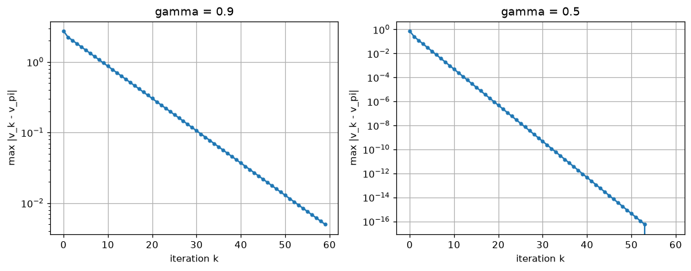

# CHAPTER 3 벨만 방정식
- 2장의 마지막에서 **전수 탐색의 벽**을 만났음 — 정책 수가 `|A|^|S|`로 폭발
- 이 장의 목표는 정책을 하나씩 세어보지 않고 **가치 함수를 직접 계산**하는 길을 여는 것
- 그 방법이 **벨만 방정식**(Bellman equation) — 강화 학습 전체에서 가장 중요한 식
- 
  - 2.4.1의 백업 다이어그램을 다시 가져온 그림. 왼쪽이 결정적 정책, 오른쪽이 확률적 정책
  - **볼 곳**: 오른쪽 그림의 맨 아래에서 가지가 계속 **점선으로 이어짐**
  - 수익 `G_t`를 정의대로 구하려면 이 무한한 가지를 끝까지 따라가야 함 → 계산 불가능
  - 벨만 방정식의 아이디어는 **한 단계만 내려가고, 그 아래는 가치 함수로 대신하는 것**
## 3.1 벨만 방정식 도출
### 3.1.1 확률과 기댓값(사전 준비)
- 벨만 방정식은 결국 기댓값 계산이므로, 먼저 기댓값을 백업 다이어그램으로 읽는 연습을 함
- 
  - 주사위 한 번 던지기의 백업 다이어그램 — 검은 점(행동)에서 여섯 갈래로 뻗음
  - **볼 곳**: 가지마다 붙은 `1/6`. 확률 × 값을 모두 더하는 것이 기댓값
  - `E[X] = Σ_x x·p(x) = (1+2+3+4+5+6)/6 = 3.5`
- 
  - **두 단계짜리** 문제 — 주사위를 던져 홀수면 일반 동전, 짝수면 앞면이 잘 나오는 동전을 던짐
  - 동전이 앞면이면 **주사위 눈만큼** 보상, 뒷면이면 `0`
  - **볼 곳**: 두 번째 단계의 확률이 첫 번째 단계의 결과에 **의존**함
    - 이것이 MDP와 같은 구조 — '지금의 결과가 다음의 확률을 바꿈'
- 
  - 위 문제를 백업 다이어그램 하나로 편 것
  - **볼 곳**: 홀수 가지(`1`, `3`, `5`)의 앞면 확률은 `1/2`, 짝수 가지(`2`, `4`, `6`)는 `4/5`
  - 기댓값은 **맨 위에서 맨 아래까지 가지의 확률을 모두 곱하고, 거기에 마지막 값을 곱해 더한 것**
    ```
    E[R] = 1/6 × (1×1/2 + 2×4/5 + 3×1/2 + 4×4/5 + 5×1/2 + 6×4/5)
         = 1/6 × (0.5 + 1.6 + 1.5 + 3.2 + 2.5 + 4.8) = 14.1 / 6 = 2.35
    ```
  - 뒷면 가지는 보상이 `0`이라 합에서 사라짐 — 그래서 6개 항만 남음
- 이 '가지를 따라 확률을 곱해 더한다'는 셈법이 그대로 벨만 방정식의 유도에 쓰임
### 3.1.2 벨만 방정식 도출
- 출발점은 2장에서 본 수익의 정의
- 
  - `G_t = R_t + γR_{t+1} + γ²R_{t+2} + ...`
- 
  - 한 시각 뒤의 수익 `G_{t+1} = R_{t+1} + γR_{t+2} + ...`
- 
  - `γ`로 묶으면 `G_t = R_t + γG_{t+1}` — **수익의 재귀 구조**([식 3.3])
  - 이 한 줄에서 이 장의 모든 식이 나옴. 무한히 이어지는 합을 **한 걸음 + 나머지**로 나눈 것
- 
  - 상태 가치 함수의 정의 `v_π(s) = E_π[G_t | S_t = s]`([식 3.4])
- [식 3.3]을 [식 3.4]에 대입하고 기댓값의 **선형성**으로 두 항을 나눔
- 
  - `v_π(s) = E_π[R_t | S_t=s] + γE_π[G_{t+1} | S_t=s]`([식 3.5])
- 
  - **볼 곳**: 하늘색으로 칠해진 **두 덩어리**. 왼쪽(보상 항)부터 전개하고 오른쪽(수익 항)은 그다음
  - 왼쪽 항은 한 걸음의 기댓값이므로 3.1.1의 셈법을 그대로 적용
- 전개에 필요한 확률이 무엇인지는 다음 그림이 보여줌
- 
  - **볼 곳**: 두 층에 각각 다른 확률분포가 걸려 있음
    - 하늘색(상태 → 행동): **정책** `π(a|s)`
    - 주황색(행동 → 다음 상태): **상태 전이 확률** `p(s'|s, a)`
  - 그래서 한 걸음의 기댓값에는 `π(a|s) p(s'|s,a)` 두 확률의 곱이 곱해짐
  - 왼쪽 위 막대그래프는 `π`가, 왼쪽 아래 막대그래프는 `p`가 확률분포임을 강조한 것
- 
  - 두 항을 각각 전개한 뒤 `Σ` 하나로 묶은 것이 **벨만 방정식**([식 3.6])
  - `v_π(s) = Σ_{a,s'} π(a|s) p(s'|s,a) { r(s,a,s') + γ v_π(s') }`
- 
  - 이중 `Σ`를 안팎으로 분리해 쓴 형태([식 3.7]) — 코드로 옮길 때 이 모양이 편함
    - 바깥 `Σ_a`가 정책에 대한 평균, 안쪽 `Σ_{s'}`가 전이에 대한 평균
- 
  - 상태 전이가 **결정적**이면(`s' = f(s,a)`) 안쪽 `Σ_{s'}`가 사라짐([식 3.8])
  - 이 책의 그리드 월드는 모두 결정적이므로 실제 계산은 이 간단한 형태를 씀
- 벨만 방정식이 말하는 것
  - `v_π(s)` = (한 걸음 보상의 기댓값) + `γ` × (다음 상태 가치의 기댓값)
  - **무한한 미래를 다 볼 필요 없이, 이웃 상태의 가치만 알면 됨**
  - 대신 `v_π`가 좌변과 우변에 모두 등장 → 자기 자신을 참조하는 **연립방정식**
## 3.2 벨만 방정식의 예
### 3.2.1 두 칸짜리 그리드 월드
- 
  - 2.4절의 두 칸짜리 그리드 월드. 정책은 `Left`/`Right`를 **각각 0.5**로 고르는 무작위 정책
  - **볼 곳**: 왼쪽 막대그래프 두 개의 높이가 같음(`0.5`) — 이번 절에서 평가할 정책 `π`
  - 규칙은 2장과 같음: 벽에 부딪히면 `-1`, `L2`로 이동하면 사과 `+1`, `γ = 0.9`
- 
  - 이 정책의 백업 다이어그램 — 한 층 내려갈 때마다 가지가 두 배
  - **볼 곳**: 상태에서 나오는 가지는 갈라지지만, **행동에서 나오는 화살표는 하나뿐**
  - 갈라짐이 정책 때문에만 생김 = **상태 전이는 결정적**이라는 뜻 → [식 3.8]을 쓸 수 있음
- 벨만 방정식을 각 상태에 대해 한 줄씩 세움
- 
  - `v_π(L1)`을 구하는 **한 단계짜리** 다이어그램 — 그림 3-8의 맨 윗부분만 떼어낸 것
  - **볼 곳**: 아래가 점선으로 이어지지 않고 `L1`, `L2`에서 **끊겨 있음**
  - 그 아래를 `v_π(L1)`, `v_π(L2)`로 대신하는 것이 벨만 방정식의 요령
  - `v_π(L1) = 0.5{-1 + 0.9 v_π(L1)} + 0.5{1 + 0.9 v_π(L2)}`
- 
  - 정리하면 `-0.55 v_π(L1) + 0.45 v_π(L2) = 0`([식 3.9])
- 
  - `v_π(L2)`에 대한 같은 그림. 보상이 `0`(왼쪽)과 `-1`(오른쪽)로 다름
  - `v_π(L2) = 0.5{0 + 0.9 v_π(L1)} + 0.5{-1 + 0.9 v_π(L2)}`
- 
  - 정리하면 `0.45 v_π(L1) - 0.55 v_π(L2) = 0.5`([식 3.10])
- 미지수 2개, 방정식 2개 → 연립해서 풀면 `v_π(L1) = -2.25`, `v_π(L2) = -2.75`
- 예제 코드: [`s01_bellman_linear.py`](s01_bellman_linear.py) — 이 연립방정식을 행렬로 풀어봄
  - 벨만 방정식은 `v_π`에 대한 **일차식**이므로 행렬로 묶으면 한 번에 풀림
    ```
    v = r_π + γ P_π v   ⟹   (I - γP_π) v = r_π
    ```
  ```
  무작위 정책의 상태 전이 행렬 P_pi =
   [[0.5 0.5]
   [0.5 0.5]]
  무작위 정책의 기대 보상 r_pi = [ 0.  -0.5]

  [무작위 정책]  연립방정식의 해
    v_pi(L1) = -2.2500
    v_pi(L2) = -2.7500
    (책 3.2절의 v_pi(L1)=-2.25, v_pi(L2)=-2.75 와 같다)

  [정책 mu = {L1:Right, L2:Left}]
    v_mu(L1) = 5.2632
    v_mu(L2) = 4.7368
    (ch02/s03_policy_bruteforce.py 가 500걸음 시뮬레이션으로 구한 값과 같다)
  ```
  - **볼 곳**: `r_π`의 첫 성분이 `0`이라는 것 — `L1`에서는 `-1`과 `+1`이 반반이라 상쇄됨
  - 아래 절반이 이 장의 요점 — 2장에서 **500걸음을 시뮬레이션해** 얻은 `5.2632`를
    여기서는 **2×2 연립방정식 한 번**으로 얻음
- 같은 코드의 후반부는 4장에서 다룰 **3×4 그리드 월드**를 12원 연립방정식으로 푼 것
  ```
  무작위 정책의 가치 함수 (연립방정식의 정확해)
       0.03    0.09    0.21    0.00
      -0.03   -0.15   -0.50   -0.37
      -0.10   -0.22   -0.44   -0.79

  ch04/s04_policy_eval.py 의 반복 계산 결과와의 최대 오차: 4.644e-10
  두 방법의 해가 일치한다. 즉 4장의 반복 계산은 이 연립방정식을 푸는 다른 방법이다.
  ```
  - **볼 곳**: 오른쪽 위 `0.00`(목표 상태)과 그 아래 `-0.37`(폭탄), 그리고 오른쪽 아래 `-0.79`
  - 무작위로 걸으면 폭탄 근처에서 헤맬 가능성이 커서 값이 음수로 내려감
  - 4장의 반복 계산 결과와 소수점 아래 9자리까지 같음 — **같은 방정식을 다른 방법으로 푼 것**
### 3.2.2 벨만 방정식의 의의
- 벨만 방정식이 없으면 가치를 구하는 길은 두 가지뿐이고 둘 다 막혀 있음
  |방법 |문제 |
  |:--|:--|
  |수익의 정의대로 계산 |무한히 이어지는 항을 모두 더해야 함(2장은 500걸음으로 잘라 근사했음) |
  |모든 궤적을 나열해 기댓값 |그림 3-8처럼 가지가 `2^n`으로 폭발 |
- 벨만 방정식을 쓰면 **미지수 `|S|`개짜리 연립일차방정식**으로 바뀜
  - 상태가 100개면 100원 연립방정식 — 유한하고, 컴퓨터가 바로 풀 수 있는 크기
  - 2장 전수 탐색의 `4^100`과 비교하면 차원이 다름
- 다만 상태가 아주 많으면 `|S| × |S|` 행렬을 다루는 것도 부담(`O(|S|³)`)
  - 그래서 실제로는 **반복 대입**으로 근사해가는 방법을 씀 → 4장 동적 프로그래밍
- 보충 예제: [`s02_bellman_iterative.py`](s02_bellman_iterative.py) — 반복 대입이 왜 되는지 확인
  - 벨만 방정식은 `v = r_π + γP_π v`라는 **고정점 방정식**이므로, 아무 값에서 시작해
    우변에 계속 대입하면 참값으로 수렴함(`v_{k+1} = r_π + γP_π v_k`)
  ```
  gamma = 0.9
    정확해   : v(L1)=-2.250000, v(L2)=-2.750000
    60회 반복: v(L1)=-2.245507, v(L2)=-2.745507
    최종 오차: 4.493e-03
    반복당 오차 감소 비율: 0.9000  (gamma = 0.9)

  gamma = 0.5
    정확해   : v(L1)=-0.250000, v(L2)=-0.750000
    60회 반복: v(L1)=-0.250000, v(L2)=-0.750000
    최종 오차: 0.000e+00
    반복당 오차 감소 비율: 0.5000  (gamma = 0.5)

  gamma가 작을수록 빨리 수렴한다. 대신 먼 미래를 보지 못한다.
  ```
  - **볼 곳**: '반복당 오차 감소 비율'이 `γ`와 **정확히 같다**는 것
    - 오차가 매 반복 `γ`배로 줄어듦 → 이것을 **축소 사상**(contraction mapping)이라고 함
    - 수렴이 보장되는 이유이자, `γ < 1`이 필요한 또 하나의 이유
  - `γ=0.9`는 60회를 돌려도 오차가 `4.5e-3` 남지만(`0.9^60 ≈ 0.0018`),
    `γ=0.5`는 `0.5^60 ≈ 8.7e-19`라 부동소수점 정밀도 안에서 완전히 일치
- 
  - **축**: x = 반복 횟수 `k`, y = 참값과의 최대 오차(**로그 눈금**)
  - **볼 곳**: 두 그래프 모두 오차가 **완전한 직선**으로 내려감
    - 로그 눈금에서 직선은 지수적 감소를 뜻하고, 그 기울기가 곧 `γ`
  - **왼쪽(`γ=0.9`)**: 60회를 돌려도 오차가 `5e-3` 언저리에 머묾
  - **오른쪽(`γ=0.5`)**: 같은 60회에 `1e-16`까지 내려가 부동소수점 한계에 닿음
    - 53회 부근에서 선이 뚝 끊긴 곳이 그 지점(오차가 0이 되어 로그로 그릴 수 없음)
## 3.3 행동 가치 함수(Q 함수)와 벨만 방정식
### 3.3.1 행동 가치 함수
- **행동 가치 함수**(action-value function) `q_π(s, a)` — 흔히 **Q 함수**라고 부름
  - 상태 `s`에서 **행동 `a`를 하고**, 그 뒤로는 정책 `π`를 따를 때의 기대 수익
- 
  - **볼 곳**: 주황색으로 감싼 범위. 왼쪽은 상태 `s`만, 오른쪽은 `s`와 **행동 `a`까지** 묶임
  - 왼쪽(`v_π`): 첫 행동도 정책 `π`가 고름 → 행동 갈래가 여러 개
  - 오른쪽(`q_π`): 첫 행동은 **자유롭게 지정** → 갈래가 하나로 고정되고, 그 아래부터 `π`
  - 이 '첫 행동만 자유'라는 차이가 4장 정책 개선과 6장 Q 러닝의 근거가 됨
- 
  - `q_π(s,a) = E_π[G_t | S_t=s, A_t=a]` — 조건에 `A_t = a`가 하나 더 붙은 것뿐([식 3.12])
- 
  - `v_π`를 유도할 때와 똑같은 순서로 전개 — `G_t = R_t + γG_{t+1}` 대입 → 선형성으로 분리
- 
  - 결과([식 3.13]) — **Q를 V로 표현하는 식**
  - `q_π(s,a) = Σ_{s'} p(s'|s,a) { r(s,a,s') + γ v_π(s') }`
  - 벨만 방정식([식 3.7])에서 바깥쪽 `Σ_a π(a|s)`만 떼어낸 모양
- 
  - 반대 방향, **V를 Q로 표현하는 식**([식 3.11])
  - `v_π(s) = Σ_a π(a|s) q_π(s,a)` — 각 행동의 가치를 정책 확률로 평균낸 것
- 즉 `V`와 `Q`는 서로 자유롭게 오갈 수 있는 **같은 정보의 두 표현**
  |  |입력 |첫 행동 |언제 편한가 |
  |:--|:--|:--|:--|
  |`v_π(s)` |상태 |정책이 고름 |상태 수만큼만 저장하면 됨(`\|S\|`개) |
  |`q_π(s,a)` |상태 + 행동 |내가 고름 |**환경 모델 없이도 행동을 고를 수 있음**(`\|S\|×\|A\|`개) |
  - 아래 줄이 핵심 — `V`만 있으면 행동을 고를 때 `p`와 `r`을 알아야 하지만,
    `Q`가 있으면 `argmax_a Q(s,a)`로 끝남 → 5장 이후 모델 없는 기법이 모두 `Q`를 쓰는 이유
### 3.3.2 행동 가치 함수를 이용한 벨만 방정식
- [식 3.13]의 `v_π(s')`에 [식 3.11]을 대입하면 **Q만으로 닫힌 식**이 나옴
- 
  - `q_π(s,a) = Σ_{s'} p(s'|s,a) { r(s,a,s') + γ Σ_{a'} π(a'|s') q_π(s',a') }`([식 3.14])
  - **볼 곳**: 안쪽에 `Σ_{a'} π(a'|s')`가 새로 생긴 것 — **다음 상태에서의 행동**까지 평균
  - 이 `Σ_{a'} π(a'|s') q_π(s',a')` 부분이 6장 SARSA의 갱신식에 그대로 나타남
- 예제 코드: [`s03_q_function.py`](s03_q_function.py) — V↔Q 변환과 [식 3.14]를 수치로 검증
  ```
  상태 가치 함수 v_pi
    v_pi(L1) = -2.2500
    v_pi(L2) = -2.7500

  행동 가치 함수 q_pi  (V로부터 계산)
    q_pi(L1, Left ) = -3.0250
    q_pi(L1, Right) = -1.4750
    q_pi(L2, Left ) = -2.0250
    q_pi(L2, Right) = -3.4750

  Q에서 V를 복원: v_pi(s) = sum_a pi(a|s) q_pi(s,a)
    L1 : -2.250000  (원래 -2.250000)
    L2 : -2.750000  (원래 -2.750000)
  ```
  - **볼 곳**: `q_pi(L1, Right) = -1.4750`이 `v_pi(L1) = -2.2500`보다 **크다**는 것
    - 무작위 정책을 따르는 것보다 `L1`에서 `Right`를 고르는 편이 낫다는 뜻
    - 이렇게 `Q`를 보면 **정책을 개선할 방향**이 바로 읽힘 → 4장 정책 반복법
  - 복원 값이 `Q`의 평균(`(-3.025 + -1.475)/2 = -2.25`)과 정확히 일치 → [식 3.11] 확인
- 3×4 그리드 월드에서 각 상태의 `argmax_a Q(s,a)`를 뽑아본 결과
  ```
  각 상태에서 Q가 최대인 행동 (탐욕 정책)
     RIGHT  RIGHT  RIGHT   GOAL
        UP   WALL     UP     UP
        UP   LEFT   LEFT   LEFT
  ```
  - 한 번 탐욕화한 것만으로 **10개 상태 전부**에서 가치가 올라감(평균 `-0.21` → `0.76`)
    - 최댓값은 평균보다 작을 수 없으므로(`max_a q_pi(s,a) ≥ Σ_a π(a|s) q_pi(s,a) = v_pi(s)`) 당연한 결과
    - 이것이 4장 **정책 개선 정리**의 내용
  - **볼 곳**: 오른쪽 아래 세 칸이 모두 `LEFT`를 가리킴 — 그런데 이 세 칸은 **아직 최적이 아님**
    - 최적 정책은 `(2,1) -> RIGHT`, `(2,2) -> UP`이고, 세 칸의 가치가 최적보다 최대 `0.28` 낮음
    - 이유는 탐욕화의 근거인 `Q`가 아직 **무작위 정책**의 것이라는 데 있음
      - `(2,2)`에서 위로 가면 닿는 `(1,2)`가 폭탄 옆이라 무작위 정책에서는 `-0.50`으로 낮게 평가됨
      - 그래서 위로 가는 짧은 길을 버리고 왼쪽으로 돌아감
    - 정책이 개선되고 나면 그 짧은 길이 안전해지지만, 낡은 `Q`는 그것을 알 수 없음
  - 그래서 한 번으로는 부족함 — 새 정책을 **다시 평가**하고 그 결과로 **다시 탐욕화**해야 함
    - 이 '평가 → 탐욕화'의 반복이 4장 **정책 반복법**
    - 상태별 수치는 [논문 4.3절](paper/ch03_bellman.pdf) 참고
## 3.4 벨만 최적 방정식
- 지금까지는 **주어진 정책** `π`를 평가했음. 이제 **최적 정책**의 가치를 직접 구함
### 3.4.1 상태 가치 함수의 벨만 최적 방정식
- 최적 정책 `π*`의 가치 함수 `v*`도 벨만 방정식을 만족함
- 
  - `v*(s) = Σ_a π*(a|s) Σ_{s'} p(s'|s,a) { r(s,a,s') + γ v*(s') }`([식 3.15])
- 여기서 2.3.4의 성질을 씀 — **최적 정책 중에는 결정적 정책이 있음**
- 
  - **볼 곳**: 하늘색 부분(안쪽 `Σ_{s'}`)의 값이 행동마다 `-2`, `0`, `4`로 계산된 상황
  - 결정적 정책이라면 `π*`는 이 중 **가장 큰 `a_3`에 확률 1**을 줄 수밖에 없음
  - 결국 `Σ_a π*(a|s)(...)` 전체가 `max_a (...)`와 같아짐
- 
  - **벨만 최적 방정식**([식 3.16])
  - `v*(s) = max_a Σ_{s'} p(s'|s,a) { r(s,a,s') + γ v*(s') }`
  - **벨만 방정식과의 유일한 차이가 `Σ_a π(a|s)` → `max_a`**
- 
  - 상태 전이가 결정적일 때의 간단한 형태([식 3.19]) — `v*(s) = max_a { r(s,a,s') + γ v*(s') }`
- `max` 때문에 생기는 중요한 변화
  - 더 이상 **일차식이 아님** → 3.2절처럼 행렬로 한 번에 풀 수 없음
  - 대신 반복 대입은 그대로 통함(여전히 축소 사상) → 4.5절 **가치 반복법**
  - 좋은 점은 **정책이 식에서 사라졌다는 것** — 정책을 모르고도 최적 가치를 구할 수 있음
### 3.4.2 행동 가치 함수의 벨만 최적 방정식
- 
  - `q*`에 대해 [식 3.14]를 그대로 쓴 것([식 3.17])
- 
  - 같은 논리로 `Σ_{a'} π*(a'|s')`를 `max_{a'}`로 바꾼 것이 **Q 버전 벨만 최적 방정식**([식 3.18])
  - `q*(s,a) = Σ_{s'} p(s'|s,a) { r(s,a,s') + γ max_{a'} q*(s',a') }`
  - **볼 곳**: `max`가 **안쪽**(`a'`)에 있음 — 6.4절 Q 러닝의 갱신식이 바로 이 모양
    ```
    Q(s,a) ← Q(s,a) + α [ r + γ max_a' Q(s',a') - Q(s,a) ]
    ```
  - 3.3.2의 SARSA 식([식 3.14])과 나란히 놓고 보면 차이는 `Σ_{a'} π` vs `max_{a'}` 하나뿐
## 3.5 벨만 최적 방정식의 예
### 3.5.1 벨만 최적 방정식 적용
- 
  - 같은 두 칸짜리 그리드 월드. 이번에는 정책이 **주어지지 않음**(그림 3-7에는 있던 막대그래프가 없음)
  - 최적 정책이 무엇인지도 함께 찾아야 함
- 
  - `L1`(왼쪽)과 `L2`(오른쪽)에서 각각 시작하는 한 단계짜리 다이어그램
  - **볼 곳**: 그림 3-9·3-10과 달리 가지에 **확률 `0.5`가 붙어 있지 않음**
  - 확률로 평균내는 대신 둘 중 **큰 쪽을 고름**(`max`)
- 두 식을 세우면
  ```
  v*(L1) = max{ -1 + 0.9·v*(L1),   1 + 0.9·v*(L2) }
  v*(L2) = max{  0 + 0.9·v*(L1),  -1 + 0.9·v*(L2) }
  ```
- `max` 안의 어느 쪽이 이길지 **가정하고 풀어본 뒤 검증**하는 것이 손으로 푸는 요령
  - `L1`에서 `Right`, `L2`에서 `Left`가 이긴다고 가정하면 `max`가 사라져 일차식이 됨
    ```
    v*(L1) = 1 + 0.9·v*(L2)
    v*(L2) = 0 + 0.9·v*(L1)
    ```
  - 풀면 `v*(L1) = 1/(1-γ²) = 5.2632`, `v*(L2) = γ/(1-γ²) = 4.7368`
  - 이 값을 원래 식에 넣어 정말 그 행동이 `max`를 달성하는지 확인하면 끝
    - `L1`: `-1 + 0.9×5.2632 = 3.74` vs `1 + 0.9×4.7368 = 5.26` → `Right`가 이김 ✓
    - `L2`: `0 + 0.9×5.2632 = 4.74` vs `-1 + 0.9×4.7368 = 3.26` → `Left`가 이김 ✓
- 
  - 최적 상태 가치 함수 `v*(L1) = 5.26`, `v*(L2) = 4.73`
  - **볼 곳**: 2.4.2에서 **네 가지 정책을 전부 평가해** 얻었던 값과 같음
  - 이번에는 정책을 하나도 나열하지 않고 방정식만으로 얻었다는 점이 다름
### 3.5.2 최적 정책 구하기
- 최적 가치 함수를 알면 최적 정책은 **탐욕적으로 뽑으면 됨**
- 
  - `μ*(s) = argmax_a q*(s,a)`([식 3.20]) — `Q`가 있으면 이것으로 끝
- 
  - `V`만 있을 때는 한 걸음 내다봐야 함([식 3.21])
  - `μ*(s) = argmax_a Σ_{s'} p(s'|s,a) { r(s,a,s') + γ v*(s') }`
  - **볼 곳**: 우변에 `p`와 `r`이 등장 — 즉 **환경 모델을 알아야** `V`에서 정책을 뽑을 수 있음
    (3.3.1 표의 마지막 행이 말한 `Q`의 장점이 여기서 드러남)
- 
  - 두 칸짜리 그리드 월드의 최적 정책 `π*` — `L1`에서 오른쪽, `L2`에서 왼쪽
  - **볼 곳**: 2장 그림 2-16의 `μ2`와 같은 정책. 사과를 먹고 되돌아오기를 반복
- 예제 코드: [`s04_bellman_optimal.py`](s04_bellman_optimal.py) — 세 가지 방법으로 같은 답에 도달
  ```
  벨만 최적 방정식을 반복 대입으로 푼 결과 (333회 반복)
    v*(L1) = 5.2632
    v*(L2) = 4.7368

  최적 정책
    L1 -> Right
    L2 -> Left

  손으로 푼 해: v*(L1) = 1/(1-gamma^2) = 5.2632, v*(L2) = gamma/(1-gamma^2) = 4.7368
  반복 대입의 결과와 일치한다.
  가정한 행동이 실제로 max를 달성하므로 이 해가 벨만 최적 방정식의 해다.

  ============================================================
  ch02/s03_policy_bruteforce.py 의 전수 탐색 결과와 대조
  ============================================================
  전수 탐색 최적 정책: L1 -> Right, L2 -> Left
  전수 탐색 최적 가치: v*(L1) = 5.2632, v*(L2) = 4.7368

  두 방법의 답이 같다.
  전수 탐색은 정책 수가 |A|^|S| 로 폭발하지만,
  벨만 최적 방정식은 상태 수에 비례하는 계산만으로 같은 답을 준다.
  ```
  - **볼 곳**: `333회 반복`. `max` 때문에 행렬로 한 번에 풀 수는 없지만,
    반복 대입은 그대로 통하며 값이 더 이상 변하지 않을 때까지 돌면 끝남
    - 여기서 멈춘 이유는 부동소수점에서 `delta`가 정확히 `0`이 되었기 때문(`0.9^333 ≈ 1e-16`)
  - 세 방법(반복 대입 · 손풀이 · 전수 탐색)의 답이 모두 같음을 `assert`로 확인
  - 마지막 두 줄이 3장 전체의 결론
## 3.6 정리
- 수익의 재귀 구조 `G_t = R_t + γG_{t+1}`에서 **벨만 방정식**이 나옴
  - `v_π(s) = Σ_a π(a|s) Σ_{s'} p(s'|s,a) { r(s,a,s') + γ v_π(s') }`
  - 무한한 미래를 다 보지 않고 **한 걸음 + 이웃 상태의 가치**로 줄이는 것이 핵심
- 벨만 방정식은 `v_π`에 대한 **연립일차방정식** → 상태 수만큼의 미지수로 정확히 풀림
  - 2장의 무한 합·전수 탐색이 유한한 계산으로 바뀜
  - `(I - γP_π) v = r_π` — [`s01_bellman_linear.py`](s01_bellman_linear.py)
  - 반복 대입으로도 풀리며, 오차가 매 반복 `γ`배로 줄어듦(축소 사상) → 4장 정책 평가
- **Q 함수** `q_π(s,a)` — 첫 행동만 자유롭게 고르고 그 뒤로는 `π`를 따를 때의 기대 수익
  - `q_π(s,a) = Σ_{s'} p(s'|s,a) { r(s,a,s') + γ v_π(s') }` (V → Q)
  - `v_π(s) = Σ_a π(a|s) q_π(s,a)` (Q → V)
  - `Q`가 있으면 **환경 모델 없이** `argmax_a Q(s,a)`로 행동을 고를 수 있음
- **벨만 최적 방정식**은 `Σ_a π(a|s)` 자리를 `max_a`로 바꾼 것
  - `v*(s) = max_a Σ_{s'} p(s'|s,a) { r(s,a,s') + γ v*(s') }`
  - `q*(s,a) = Σ_{s'} p(s'|s,a) { r(s,a,s') + γ max_{a'} q*(s',a') }`
  - 정책이 식에서 사라져 **최적 가치를 곧바로** 구할 수 있음. 대신 `max` 때문에 비선형
- 최적 가치를 알면 최적 정책은 **탐욕적으로** 뽑으면 됨: `μ*(s) = argmax_a q*(s,a)`
- 두 칸짜리 그리드 월드에서 `v*(L1) = 5.2632`, `v*(L2) = 4.7368`, `π* = (Right, Left)`
  - 2장이 정책 4가지를 전부 평가해 얻은 답을, 3장은 방정식 두 줄로 얻음
- 다음 장에서는 이 방정식들을 **반복 계산**으로 푸는 동적 프로그래밍을 다룸
  - 벨만 방정식 반복 → **정책 평가**, 벨만 최적 방정식 반복 → **가치 반복법**
