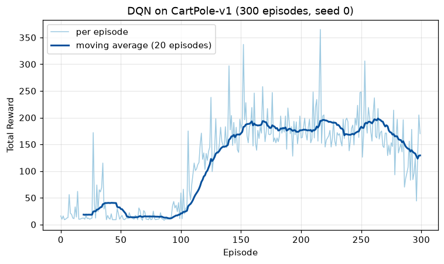

# CHAPTER 8 DQN
- 7장에서 `Q`를 신경망으로 바꿔봤지만, 그리드 월드에서는 표보다 나을 것이 없었음
  - 상태가 12개뿐인 데다 원핫 벡터라 **일반화할 여지가 없었기** 때문
- 이 장에서는 상태가 **연속값**인 문제(카트 폴)를 풀며 신경망이 왜 필요한지 확인함
- 그리고 7장 끝에서 예고한 세 가지 문제를 처리해 **DQN**(Deep Q-Network)을 완성
  |문제 |처방 |
  |:--|:--|
  |연속한 경험이 서로 닮아 학습이 편향됨 |**경험 재생**(experience replay) |
  |목표값 `T`가 매 갱신 흔들림 |**목표 신경망**(target network) |
  |한 걸음마다 하나씩만 학습해 비효율적 |**미니배치** |
- DQN은 2015년 아타리 게임 49종을 사람 수준으로 플레이해 심층 강화 학습의 출발점이 된 알고리즘
## 8.1 OpenAI Gym
### 8.1.1 OpenAI Gym 기초 지식
- 
  - **Gym** — 강화 학습용 환경을 모아둔 라이브러리. 문제만 제공하고 알고리즘은 제공하지 않음
  - **볼 곳**: 왼쪽 목록의 분류 — `Atari`, `MuJoCo`, `Toy Text`, `Classic Control`
  - 이 장에서 쓰는 것은 `Classic Control`의 **Cart Pole**
- 이 저장소는 후속 프로젝트인 **Gymnasium**을 씀(`import gymnasium as gym`)
  - 원서의 `gym`은 유지보수가 끝났고, `step()`의 반환값이 4개에서 5개로 바뀌었음
    ```python
    next_state, reward, terminated, truncated, info = env.step(action)
    done = terminated | truncated
    ```
  - `terminated` — 문제의 규칙대로 끝남(막대가 쓰러짐)
  - `truncated` — 시간 제한에 걸려 끊김(`CartPole-v1`은 500걸음)
  - 둘을 구분하는 이유: `truncated`는 진짜 종료가 아니라서 가치를 `0`으로 두면 안 됨
    (이 장의 예제는 단순화를 위해 둘을 합쳐 쓰지만, 엄밀하게는 나눠 다루는 편이 좋음)
- 
  - **카트 폴** — 카트 위에 세운 막대가 쓰러지지 않게 카트를 좌우로 미는 문제
  |  |내용 |
  |:--|:--|
  |상태 |`[카트 위치, 카트 속도, 막대 각도, 막대 각속도]` — **4차원 실수** |
  |행동 |`0`(왼쪽으로 밀기), `1`(오른쪽으로 밀기) — 2가지 |
  |보상 |막대가 서 있는 매 걸음 `+1` |
  |종료 |막대가 12°를 넘어 기울거나, 카트가 화면 밖(±2.4)으로 나가거나, 500걸음 |
  - **상태가 연속값**이라는 점이 결정적 — 6장까지의 표 방식은 아예 쓸 수 없음
  - 최대 점수는 500(`CartPole-v1` 기준. 구버전 `v0`는 200이라 책의 그래프는 200에서 잘림)
### 8.1.2 랜덤 에이전트
- 예제 코드: [`s01_gym_play.py`](s01_gym_play.py)
```python
env = gym.make('CartPole-v1', render_mode='human')
state = env.reset()[0]
done = False

while not done:
    env.render()
    action = np.random.choice([0, 1])   # 행동 선택(무작위)
    next_state, reward, terminated, truncated, info = env.step(action)
    done = terminated | truncated
env.close()
```
- 
  - `render_mode='human'`으로 만들면 창이 떠서 진행 과정이 보임
  - 무작위로 밀면 **10~30걸음** 만에 막대가 쓰러짐 — 이것이 학습 전의 기준선
  - 화면이 없는 환경(WSL·서버)에서는 `render_mode='rgb_array'`로 두면 창 없이 실행됨
- 기억해둘 API
  |메서드 |역할 |
  |:--|:--|
  |`gym.make(id)` |환경 생성 |
  |`env.reset()` |초기 상태로 되돌리고 상태 반환(`(state, info)` 튜플) |
  |`env.step(action)` |한 걸음 진행 |
  |`env.render()` |화면 표시 |
  - 5.3.1에서 만든 `GridWorld.step()`과 같은 인터페이스 — 환경만 바꿔 끼우면 됨
## 8.2 DQN의 핵심 기술
### 8.2.1 경험 재생
- 
  - **지도 학습의 흐름** — 데이터셋에서 **무작위로** 미니배치를 뽑아 신경망에 넣음
  - **볼 곳**: '무작위로 추출'이라는 화살표
  - 무작위로 뽑는 이유는 데이터가 **독립적이고 고르게** 섞이도록 하기 위함
    (`0`만 100장 연속으로 학습시키면 신경망이 `0`만 답하게 됨)
- 그런데 7장의 Q 러닝은 정반대로 하고 있었음
  - `(S_0, A_0, R_0, S_1)`, `(S_1, A_1, R_1, S_2)`, ... 를 **겪은 순서 그대로** 학습
  - 연속한 경험은 서로 매우 닮아 있음(카트 폴이라면 거의 같은 각도, 같은 속도)
  - 게다가 한 번 쓴 경험은 곧바로 버려짐 → **데이터 효율이 나쁨**
- 
  - **경험 재생** — 겪은 경험을 **버퍼에 쌓아두고, 거기서 무작위로 꺼내** 학습
  - **볼 곳**: 그림 8-4와 구조가 똑같음. '데이터셋' 자리에 '버퍼'가 들어갔을 뿐
  - 얻는 것 세 가지
    1. 연속한 경험의 상관관계가 끊겨 학습이 안정됨
    2. 한 경험을 여러 번 재사용 → 데이터 효율이 좋아짐
    3. 미니배치로 묶어 한 번에 학습 → 계산 효율도 좋아짐
- **경험 재생이 가능한 이유가 Q 러닝이 오프-정책이기 때문**
  - 버퍼 안의 데이터는 **옛날 정책이 만든 것**. 온-정책 기법(SARSA)이라면 쓸 수 없음
  - 6.4에서 Q 러닝이 중요도 샘플링 없이 오프-정책이 된다고 했던 성질이 여기서 힘을 발휘함
### 8.2.2 경험 재생 구현
- 예제 코드: [`s02_replay_buffer.py`](s02_replay_buffer.py)
```python
class ReplayBuffer:
    def __init__(self, buffer_size, batch_size):
        self.buffer = deque(maxlen=buffer_size)   # 꽉 차면 오래된 것부터 밀려남
        self.batch_size = batch_size

    def add(self, state, action, reward, next_state, done):
        self.buffer.append((state, action, reward, next_state, done))

    def get_batch(self):
        data = random.sample(self.buffer, self.batch_size)   # 무작위 추출

        state = np.stack([x[0] for x in data])
        action = np.array([x[1] for x in data])
        reward = np.array([x[2] for x in data])
        next_state = np.stack([x[3] for x in data])
        done = np.array([x[4] for x in data]).astype(np.int32)
        return state, action, reward, next_state, done
```
- `deque(maxlen=...)`를 쓰는 이유 — **오래된 경험을 자동으로 버리기** 위해
  - 정책이 좋아지면 옛날 경험은 쓸모가 떨어짐(1.5절 비정상 문제와 같은 사정)
- 
  - `get_batch()`가 하는 일 — 버퍼에서 몇 개를 뽑아 **항목별로 묶어 배열로** 만듦
  - **볼 곳**: `state`는 `np.stack`으로 `(3, 4)`가 되고, `action`은 `np.array`로 `(3,)`이 됨
  - `state`는 이미 `ndarray`라 **쌓아야** 하고(`stack`), `action`은 정수라 **묶기만** 하면 됨
- `done`을 `int32`로 바꾸는 이유는 8.2.4의 `(1 - done)` 계산에 쓰기 위함
- 실행해보면
  ```
  버퍼에 쌓인 경험 수: 95
  state.shape (32, 4)
  action.shape (32,)
  reward.shape (32,)
  next_state.shape (32, 4)
  done.shape  (32,)

  state 한 개 예: [-0.1512 -1.5448  0.132   2.3676]
  ```
  - **볼 곳**: 10 에피소드를 돌았는데 경험이 `95`개뿐
    - 계속 왼쪽으로만 밀었으니(`action = 0`) 한 판이 10걸음 남짓
  - `state`의 네 값이 `[위치, 속도, 각도, 각속도]` — 정수 인덱스가 아닌 **실수 벡터**
### 8.2.3 목표 신경망
- 7.4.3에서 `unchain()`으로 목표 `T`를 상수로 만들었지만 문제가 남아 있었음
  - `T = R + γ max_a Q(S', a)`의 `Q`도 **학습 중인 바로 그 신경망**
  - 매개변수를 갱신할 때마다 `T`도 함께 움직임 → **맞춰야 할 목표가 계속 움직임**
  - 게다가 `Q(S,A)`를 올리면 비슷한 상태인 `Q(S',a)`도 함께 올라가 목표도 같이 밀려 올라감
    (발산하거나 값이 부풀려지는 원인)
- **목표 신경망** — `T` 계산 전용으로 **복사본을 하나 더** 두고, 그것은 **가끔씩만** 갱신
  - 일정 기간 목표가 고정되므로 지도 학습에 가까운 안정된 회귀 문제가 됨
  - 학습용 신경망(`qnet`)과 목표용 신경망(`qnet_target`) 두 개를 함께 유지함
### 8.2.4 목표 신경망 구현
- 예제 코드: [`s03_dqn.py`](s03_dqn.py)
```python
self.qnet = QNet(self.action_size)         # 원본 신경망(학습 대상)
self.qnet_target = QNet(self.action_size)  # 목표 신경망
self.optimizer = optimizers.Adam(self.lr)
self.optimizer.setup(self.qnet)            # 옵티마이저에는 qnet만 등록

def sync_qnet(self):                       # 두 신경망 동기화
    self.qnet_target = copy.deepcopy(self.qnet)
```
- **볼 곳**: 옵티마이저에 `qnet`만 등록했다는 것 — `qnet_target`은 학습되지 않고 **복사로만** 갱신
- 갱신 부분
```python
def update(self, state, action, reward, next_state, done):
    self.replay_buffer.add(state, action, reward, next_state, done)
    if len(self.replay_buffer) < self.batch_size:
        return                                   # 데이터가 모자라면 학습하지 않음

    state, action, reward, next_state, done = self.replay_buffer.get_batch()
    qs = self.qnet(state)
    q = qs[np.arange(self.batch_size), action]   # 고른 행동의 Q만 꺼냄

    next_qs = self.qnet_target(next_state)       # 목표는 target 신경망으로
    next_q = next_qs.max(axis=1)
    next_q.unchain()
    target = reward + (1 - done) * self.gamma * next_q

    loss = F.mean_squared_error(q, target)
    self.qnet.cleargrads()
    loss.backward()
    self.optimizer.update()
```
- 
  - `q = qs[np.arange(batch_size), action]`이 하는 일
  - **볼 곳**: 왼쪽 `qs`(32×2)에서 `action`이 가리키는 **행마다 다른 열**을 하나씩 뽑음
  - `qs[:, action]`이 아님에 주의 — 배치의 각 데이터마다 고른 행동이 다르기 때문
- `(1 - done)`을 곱하는 이유 — 종료한 데이터는 `next_q`를 통째로 지움(`v(종료) = 0`)
  - `done`을 `int32`로 저장해둔 덕에 `if`문 없이 배열 연산 한 줄로 처리됨
- 신경망은 은닉층 2개(128, 128), 옵티마이저는 `Adam`
  - 7장(은닉 1층, `SGD`)보다 커진 것은 문제가 어려워졌기 때문
- 학습 루프에서 주기적으로 동기화
```python
if episode % sync_interval == 0:   # 20 에피소드마다
    agent.sync_qnet()
```
### 8.2.5 DQN 실행
- 하이퍼파라미터: `γ=0.98`, `lr=0.0005`, `ε=0.1`, 버퍼 10,000, 배치 32, 300 에피소드
- 
  - 에피소드별 보상 총합(1회 실행)
  - **볼 곳**: 50~70 에피소드 부근에서 **갑자기 치솟는 구간**과, 그 뒤로도 계속되는 **심한 진동**
  - 최고점(200)에 닿았다가 30까지 떨어지기를 반복 — 강화 학습에서 흔한 모습
  - 오른쪽 끝(280 이후)에서 오히려 성적이 떨어진 것도 눈여겨볼 것 — **학습이 단조롭지 않음**
- 
  - 같은 실험을 100번 돌려 평균낸 것(1.4.4에서 쓴 그 방법)
  - **볼 곳**: 진동이 사라지고 **S자 곡선**이 드러남
    - 0~60 에피소드: `15` 근처에서 거의 변화 없음(버퍼를 채우는 중)
    - 60~150 에피소드: 가파르게 상승
    - 150 이후: `150` 근처에서 정체하다가 **서서히 내려감**
  - 마지막 하강 구간이 DQN의 알려진 불안정성 — 학습을 오래 돌린다고 계속 좋아지지 않음
- 직접 실행해본 결과(300 에피소드, 시드 고정)
  ```
  --- 구간별 평균 보상 ---
      0~ 49 에피소드: 26.3
     50~ 99 에피소드: 16.0
    100~149 에피소드: 131.9
    150~199 에피소드: 183.1
    200~249 에피소드: 182.2
    250~299 에피소드: 157.0
  학습 후 탐욕 정책(epsilon=0)으로 5판: [90.0, 77.0, 78.0, 89.0, 74.0]
  ```
  - **볼 곳**: `50~99` 구간이 `16.0`으로 **처음보다 오히려 나빠졌다는 것**
    - 무작위에 가까운 초기 신경망이 한쪽으로 편향되며 잠깐 퇴보하는 구간
  - `100` 에피소드를 넘기며 `131.9`로 뛰고 `183.1`에서 정점 → 그림 8-9의 S자와 같은 모양
  - `250~299`에서 `157.0`으로 내려간 것도 그림 8-9의 하강 구간과 일치
  - **마지막 줄이 중요** — 탐욕 정책으로 5판을 돌리니 `74~90`으로 학습 중 평균보다 낮음
    - 마지막 순간의 신경망이 최고 성능이라는 보장이 없음
    - 실무에서는 주기적으로 평가해 **가장 좋았던 매개변수를 따로 저장**해두어야 함
- 
  - 위 실행을 그림으로 옮긴 것(연한 선 = 매 에피소드, 진한 선 = 20 에피소드 이동평균)
  - **축**: x = 에피소드, y = 그 판에서 받은 보상 총합
  - **볼 곳 1**: 진한 선이 `90` 에피소드까지 **`12~40` 사이에 낮게 머묾**
    - `40` 에피소드 부근에서 잠깐 `40`까지 솟았다가 다시 `12`로 내려앉음
    - 콘솔 출력의 `50~99` 구간이 `16.0`으로 처음보다 나빴던 것이 이 골짜기
  - **볼 곳 2**: `100~150` 구간의 **가파른 상승**(`21 → 171`). 그림 8-9의 S자와 같은 모양
  - **볼 곳 3**: 오른쪽 끝에서 진한 선이 `198`(264 에피소드) → `129`(마지막)로 **뚜렷하게 내려감**
    - 학습을 더 돌린다고 계속 좋아지지 않는다는 것을 한 번의 실행에서도 볼 수 있음
    - 앞의 콘솔 출력에서 탐욕 정책 성적이 `74~90`으로 낮게 나온 이유가 이것
  - 연한 선은 `365`까지 치솟았다가 곧바로 곤두박질치기를 반복함
    - `CartPole-v1`의 상한이 500이라 책의 그래프(200에서 잘림)보다 위쪽이 넓게 보임
## 8.3 DQN과 아타리
- 카트 폴은 상태가 4차원이었음. 원래의 DQN 논문은 **게임 화면 픽셀**을 입력으로 받음
### 8.3.1 아타리 게임 환경
- 
  - 아타리 게임 〈퐁〉의 화면 — 왼쪽이 컴퓨터, 오른쪽이 플레이어, 가운데가 공
  - 상태는 `210 × 160 × 3`(RGB) 픽셀. 행동은 조이스틱 조작 18가지
  - **한 가지 신경망 구조와 한 벌의 하이퍼파라미터로 49종의 게임을 학습**한 것이 DQN의 성취
    - 게임마다 사람이 손보지 않았다는 점이 핵심
### 8.3.2 전처리
- 픽셀을 그대로 쓰면 너무 무거워 다음 전처리를 함
  |전처리 |내용 |이유 |
  |:--|:--|:--|
  |**흑백화** |RGB 3채널 → 1채널 |색은 게임 진행에 거의 무관 |
  |**크기 축소** |`210×160` → `84×84` |계산량 절감 |
  |**프레임 스택** |최근 **4프레임**을 겹쳐 한 상태로 |한 장으로는 **움직임을 알 수 없음** |
  |**보상 클리핑** |보상을 `-1`, `0`, `+1`로 |게임마다 점수 단위가 달라 |
- 
  - 프레임 스택이 필요한 이유를 보여주는 그림 — 공의 잔상이 대각선으로 이어짐
  - **볼 곳**: 잔상이 있어야 공이 **어느 방향으로 움직이는지** 알 수 있음
  - 한 장만 보면 공의 위치는 알아도 속도를 모름 → **마르코프 성질이 깨짐**(2.2.1)
  - 4프레임을 겹치는 것은 '필요한 정보를 모두 상태에 담는다'는 그 약속을 지키는 방법
- 그래서 최종 입력 형상은 `4 × 84 × 84`
### 8.3.3 CNN
- 
  - DQN이 쓴 신경망 — 합성곱층 3개 + 완전연결층 2개
  - **볼 곳**: 형상이 `4×84×84 → 32×20×20 → 64×9×9 → 64×7×7 → 512 → 18`로 줄어드는 흐름
  - 공간 크기는 줄고 채널 수는 늘어남 — 위치 정보 대신 **패턴 정보**를 뽑아가는 과정
  - 마지막 `18`이 행동 개수. 7.4.2의 '상태만 넣고 행동 수만큼 출력' 구조 그대로
- **합성곱**(convolution)을 쓰는 이유
  - 이미지는 이웃 픽셀끼리 관계가 있음. 완전연결층은 그 구조를 무시함
  - 같은 필터를 화면 전체에 적용하므로 **매개변수가 훨씬 적음**
  - '어디에 있든 같은 모양이면 같게 인식' — 공이 화면 어디에 있어도 공으로 봄
### 8.3.4 기타 아이디어
- 
  - **ε 어닐링**(annealing) — `ε`를 처음 `1`에서 시작해 100만 걸음에 걸쳐 `0.1`까지 낮춤
  - **볼 곳**: 오른쪽이 `0.1`에서 **평평해짐**. `0`까지 내리지는 않음
  - 초반에는 아는 것이 없으니 탐색 위주, 나중에는 활용 위주
  - 끝까지 `0.1`을 남기는 이유는 학습이 끝날 때까지 새로운 상태를 만날 여지를 두기 위함
  - 1.4.4의 `ε` 비교 실험에서 '큰 ε는 빨리 오르고 작은 ε는 나중에 앞선다'고 했던 것의 실용적 결론
- 그 밖에
  - **버퍼 크기 100만** — 이 장 예제(10,000)의 100배
  - **RMSProp** 옵티마이저, 목표 신경망 동기화 주기 10,000걸음
  - **프레임 스킵** — 4프레임마다 한 번만 행동을 결정(계산 절감 + 시간 축 압축)
## 8.4 DQN 확장
- DQN 이후 제안된 개선안들. 대부분 **몇 줄만 고치면 되는** 아이디어라는 점이 인상적
### 8.4.1 Double DQN
- 문제: DQN의 목표 `R + γ max_a Q_target(S', a)`에는 **과대평가 편향**이 있음
  - `max`는 추정 오차가 **위로 튄 값**을 골라내는 연산
  - 참값이 모두 같은 행동들이라도, 잡음이 섞이면 `max`는 항상 참값보다 큼
  - 이 부풀림이 부트스트래핑으로 계속 전파됨
- 해법: **고르는 신경망과 평가하는 신경망을 분리**
  ```
  DQN        : target = R + γ · Q_target(S', argmax_a Q_target(S', a))
  Double DQN : target = R + γ · Q_target(S', argmax_a Q(S', a))
                                            └─ 고르기는 원본 qnet이
                              └─ 값 매기기는 목표 신경망이
  ```
  - 어느 한쪽이 어떤 행동을 과대평가해도, 다른 쪽이 같은 실수를 할 이유가 없음
  - 목표 신경망은 이미 있으므로 **추가 비용이 사실상 없음**
### 8.4.2 우선순위 경험 재생(PER)
- 문제: 경험 재생은 버퍼에서 **균등하게** 뽑음. 하지만 경험마다 배울 것의 양이 다름
  - **TD 오차가 큰 경험** = 예측이 크게 빗나간 경험 = 배울 것이 많은 경험
- 해법: TD 오차의 크기에 비례하는 확률로 뽑음 (**Prioritized Experience Replay**)
- 다만 균등하지 않게 뽑으면 **분포가 왜곡됨** → 5.5.2의 **중요도 샘플링**으로 보정
  - 자주 뽑히는 경험의 갱신량을 그만큼 줄임
  - 5장에서 배운 도구가 여기서 다시 쓰임
### 8.4.3 Dueling DQN
- 
  - **어드밴티지 함수**(advantage function)([식 8.1])
  - `A_π(s,a) = Q_π(s,a) - V_π(s)` — 그 상태의 평균보다 이 행동이 **얼마나 더 나은가**
- 
  - 뒤집어 쓰면 `Q_π(s,a) = A_π(s,a) + V_π(s)`([식 8.2])
- 왜 나누는가 — 많은 상황에서 **어떤 행동을 해도 결과가 비슷함**
  - 카트 폴에서 막대가 똑바로 서 있으면 좌우 어느 쪽이든 큰 차이가 없음
  - 그런 상태에서 중요한 것은 '어느 행동이 나은가'가 아니라 **'이 상태가 얼마나 좋은가'**
  - `V(s)`는 모든 행동의 경험에서 함께 배울 수 있어 **학습 효율이 좋아짐**
- 
  - **위(DQN)**: 마지막에 완전연결층 하나로 행동 수만큼 출력
  - **아래(Dueling DQN)**: 출력 직전에 **두 갈래로 나뉨** — `V(s)`(스칼라)와 `A(s,a)`(행동 수)
  - **볼 곳**: 두 갈래가 초록색 부분에서 **다시 합쳐짐**(`Q = V + A`)
  - 앞쪽 합성곱층은 그대로 공유하므로 계산 비용은 거의 같음
  - 실제 구현에서는 `A`의 평균을 빼서 `Q = V + (A - mean(A))`로 둠
    (`V`와 `A`를 나누는 방법이 무수히 많아 학습이 불안정해지는 것을 막기 위해)
- **레인보우**(Rainbow, 10장) — 이 셋을 포함한 6가지 개선안을 모두 합친 것
## 8.5 정리
- **Gym/Gymnasium** — 강화 학습 환경 모음. `reset()`과 `step()`만 알면 됨
  - **카트 폴**은 상태가 `[위치, 속도, 각도, 각속도]`인 **4차원 실수** → 표 방식이 불가능
- **DQN = Q 러닝 + 신경망 + 경험 재생 + 목표 신경망**
  |기술 |해결하는 문제 |구현 |
  |:--|:--|:--|
  |경험 재생 |연속 경험의 상관관계, 데이터 낭비 |`deque` + `random.sample` |
  |목표 신경망 |목표값이 계속 움직임 |복사본을 두고 주기적으로 `deepcopy` |
  |미니배치 |한 걸음 한 갱신의 비효율 |32개씩 묶어 학습 |
  - 경험 재생을 쓸 수 있는 것은 **Q 러닝이 오프-정책이기 때문**(6.4의 성질이 여기서 실제로 쓰임)
  - `(1 - done)`을 곱해 종료 상태의 `next_q`를 지우는 처리를 잊지 말 것
- 학습 곡선은 **한 번의 실행으로 판단할 수 없음** — 여러 번 돌려 평균낼 것(1.4.4)
  - 그림 8-9처럼 평균을 내면 S자 곡선이 드러나며, **후반에 성능이 떨어지는 구간**도 보임
  - 마지막 매개변수가 최선이라는 보장이 없으므로 좋았던 시점을 저장해둬야 함
- **아타리**에 적용하려면 전처리(흑백화·축소·**4프레임 스택**·보상 클리핑)와 **CNN**이 필요
  - 프레임 스택은 속도 정보를 넣어 **마르코프 성질**을 지키기 위한 조치
- **확장** — Double DQN(과대평가 억제), PER(중요한 경험을 자주), Dueling DQN(`Q = V + A`)
- 여기까지의 모든 알고리즘은 **가치 함수를 배우고 그것을 탐욕화**해 정책을 얻는 방식
  - 행동이 연속값이면 `max_a`를 계산할 수 없어 이 접근 자체가 막힘
- 다음 장에서는 **정책을 직접 학습**하는 정책 경사법을 다룬다
