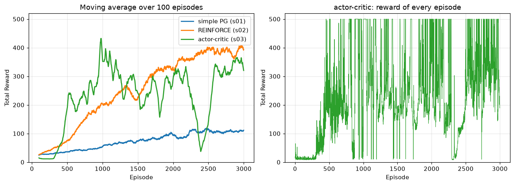

# CHAPTER 9 정책 경사법
- 8장까지의 모든 알고리즘은 같은 틀이었음 — **가치 함수를 배우고, 그것을 탐욕화해 정책을 얻음**
  - `Q`가 주인공이고 정책은 `argmax_a Q(s,a)`라는 **부산물**
- 이 장은 그 틀을 버리고 **정책 자체를 신경망으로 두고 직접 학습**함
  - 이런 접근을 **정책 기반**(policy-based) 기법, 또는 **정책 경사법**(policy gradient method)이라고 함
- 왜 필요한가
  |가치 기반의 한계 |
  |:--|
  |행동이 **연속값**이면 `max_a Q(s,a)`를 계산할 수 없음 |
  |정책이 항상 결정적(탐욕적)이라 **확률적 정책이 최선인 문제**를 다루지 못함 |
  |`Q`가 조금만 바뀌어도 `argmax`가 통째로 뒤집혀 정책이 급변함 |
- 이 장에서 만드는 것
  |절 |알고리즘 |한 줄 요약 |
  |:--|:--|:--|
  |9.1 |가장 간단한 정책 경사법 |궤적 전체의 수익 `G(τ)`로 모든 행동을 평가 |
  |9.2 |**REINFORCE** |각 시점을 그 시점 이후의 수익 `G_t`로 평가 |
  |9.3 |베이스라인 |`G_t`에서 기준선을 빼 분산을 줄임 |
  |9.4 |**행위자-비평자** |기준선을 신경망으로 배우고 `G_t`를 TD 목표로 대체 |
## 9.1 가장 간단한 정책 경사법
### 9.1.1 정책 경사법 도출
- 정책을 매개변수 `θ`를 가진 신경망 `π_θ(a|s)`로 둠
- 목적 함수는 **기대 수익** `J(θ) = E_{τ~π_θ}[G(τ)]`
  - `τ`(타우)는 한 판의 **궤적**(trajectory) — `S_0, A_0, R_0, S_1, A_1, ...`
  - `G(τ)`는 그 궤적에서 얻은 수익
- 목표는 `J(θ)`를 **크게** 만드는 것 → **경사 상승법**(`θ ← θ + α ∇_θ J(θ)`)
  - 7장의 회귀는 손실을 줄였지만(경사 하강), 여기서는 수익을 늘림
- 
  - 유도의 시작과 끝([식 D.1] → [식 9.1]). 자세한 전개는 책 부록 D
  - 요령은 **로그 미분 트릭** `∇p = p ∇log p` — 기댓값 안으로 미분을 넣기 위한 장치
- 
  - **정책 경사 정리**([식 9.1])
  - `∇_θ J(θ) = E_{τ~π_θ}[ Σ_{t=0}^{T} G(τ) ∇_θ log π_θ(A_t|S_t) ]`
- 이 식이 말하는 것을 말로 풀면
  - `∇_θ log π_θ(A_t|S_t)`는 **그 행동을 고를 확률을 높이는 방향**
  - 거기에 `G(τ)`를 곱함 → **잘된 판이면 그 판의 행동들을 전부 더 자주 하도록,
    못한 판이면 전부 덜 하도록** `θ`를 움직임
  - 환경의 `p(s'|s,a)`가 식에서 사라졌다는 점이 중요 — **모델이 필요 없음**
- 
  - 한 궤적에 대해 계산되는 항들
  - **볼 곳**: 시점마다 색이 다른 항이 하나씩 생기고 **전부 더해짐**
  - 그리고 **모든 항에 똑같은 `G(τ)`가 곱해져 있음** — 이 점이 9.2에서 고쳐질 부분
- 
  - 기댓값은 계산할 수 없으므로 **실제로 한 판 해보고 그 결과로 근사**([식 9.2])
  - 5장 몬테카를로법과 같은 논리
### 9.1.2 정책 경사법 알고리즘
- 한 사이클의 흐름
  1. 현재 정책 `π_θ`로 한 판을 끝까지 진행하며 `(보상, 행동 확률)`을 기록
  2. 그 판의 수익 `G(τ)`를 계산
  3. [식 9.2]로 기울기를 구해 `θ`를 갱신
- 딥러닝 프레임워크는 **최소화**를 기본으로 하므로 부호를 뒤집어 **손실**로 다룸
  ```
  L(θ) = - Σ_t G(τ) log π_θ(A_t|S_t)
  ```
  - 이 `L`을 경사 하강으로 줄이는 것이 `J`를 경사 상승으로 늘리는 것과 같음
- 성격
  - **온-정책** — 반드시 **지금의 정책**으로 모은 데이터여야 함
    - 그래서 8장의 경험 재생을 쓸 수 없음(옛 정책의 데이터는 무효)
    - 한 판 쓰고 버리므로 **샘플 효율이 나쁨**
  - **몬테카를로 계열** — 에피소드가 끝나야 갱신할 수 있음
### 9.1.3 정책 경사법 구현
- 예제 코드: [`s01_simple_pg.py`](s01_simple_pg.py) (카트 폴, `γ=0.98`, `lr=0.0002`, 3,000 에피소드)
```python
class Policy(Model):
    def __init__(self, action_size):
        super().__init__()
        self.l1 = L.Linear(128)
        self.l2 = L.Linear(action_size)

    def forward(self, x):
        x = F.relu(self.l1(x))
        x = F.softmax(self.l2(x))   # 출력이 확률분포
        return x
```
- **볼 곳**: 마지막이 **소프트맥스** — 출력의 합이 `1`인 확률분포가 됨
  - 7·8장 `QNet`의 출력층에는 활성화 함수가 없었음(Q 값은 임의의 실수)
  - 여기서 출력하는 것은 **정책 그 자체**
```python
def get_action(self, state):
    state = state[np.newaxis, :]
    probs = self.pi(state)[0]
    action = np.random.choice(len(probs), p=probs.data)   # 확률대로 뽑음
    return action, probs[action]     # 행동과 그 확률(Variable)을 함께 반환
```
- **볼 곳**: `probs[action]`을 **`Variable`인 채로** 돌려준다는 것
  - 나중에 `log`를 취해 역전파해야 하므로 계산 그래프를 끊으면 안 됨
  - `ε`가 없음 — **확률적 정책 자체가 탐색을 담당**하므로 ε-탐욕이 필요 없음
```python
def update(self):
    self.pi.cleargrads()

    G, loss = 0, 0
    for reward, prob in reversed(self.memory):   # 궤적 전체의 수익 G(τ)를 먼저 계산
        G = reward + self.gamma * G

    for reward, prob in self.memory:             # 모든 시점에 같은 G를 곱함
        loss += -F.log(prob) * G

    loss.backward()
    self.optimizer.update()
    self.memory = []
```
- **볼 곳**: 루프가 **두 개**로 나뉘어 있음
  - 첫 루프가 `G(τ)` 하나를 구하고, 둘째 루프가 그것을 모든 시점에 똑같이 곱함
  - 그림 9-1을 그대로 옮긴 것. 9.2에서 이 두 루프가 하나로 합쳐짐
- 
  - 에피소드별 보상 총합(1회 실행)
  - **볼 곳**: 그래프가 통째로 **까맣게 칠해진 띠**처럼 보임 — 진동이 극심함
  - 띠의 아래쪽 경계가 계속 `10` 근처에 붙어 있음(가끔 아주 빨리 쓰러짐)
  - 그래도 띠 전체가 서서히 위로 올라가고 있음
- 
  - 100번 실행을 평균낸 것
  - **볼 곳**: `20`에서 시작해 3,000 에피소드에 걸쳐 `110` 근처까지 **거의 직선으로** 올라감
  - 8장 DQN의 그림 8-9(S자 곡선, 150 에피소드면 정점)와 비교하면 **훨씬 느림**
  - 3,000 에피소드를 다 써도 아직 오르는 중 — 학습이 끝나지 않았음
- 직접 실행해본 결과(시드 고정, `CartPole-v1`이라 최대 점수는 500)
  ```
     0~ 499 에피소드 평균: 30.1
   500~ 999 에피소드 평균: 45.5
  1000~1499 에피소드 평균: 68.6
  1500~1999 에피소드 평균: 85.5
  2000~2499 에피소드 평균: 102.1
  2500~2999 에피소드 평균: 107.1
  마지막 100 에피소드 평균: 111.4 / 최고: 472
  ```
  - **볼 곳**: 500 에피소드마다 꾸준히 오르지만 **증가폭이 점점 줄어듦**(`15 → 23 → 17 → 17 → 5`)
  - 최고 기록이 `472`인데 평균이 `111`이라는 것이 **분산이 얼마나 큰지** 말해줌
  - 왜 이렇게 느린가 — [식 9.1]의 추정치가 **분산이 너무 크기** 때문. 다음 절부터 그것을 줄임
## 9.2 REINFORCE
### 9.2.1 REINFORCE 알고리즘
- 9.1의 식에는 명백한 낭비가 있음 — **모든 시점에 같은 `G(τ)`를 곱함**
  - 시점 `t`의 행동은 **`t` 이전에 받은 보상에는 아무 영향도 줄 수 없음**
  - 그런데 `G(τ)`에는 그 과거 보상까지 들어 있음
  - 관계없는 값이 섞이면 기울기의 **분산만 커지고 편향은 줄지 않음**
- 
  - `G(τ)`를 그 시점 이후의 수익 `G_t`로 바꾼 것([식 9.3])
  - `∇_θ J(θ) = E[ Σ_t G_t ∇_θ log π_θ(A_t|S_t) ]`, `G_t = R_t + γR_{t+1} + ... + γ^{T-t}R_T`
  - **볼 곳**: `G(τ)`가 `G_t`로 바뀐 것뿐인데 **기댓값은 그대로**이고 분산만 줄어듦
    - 과거 보상 항은 기댓값이 `0`이라 빼도 편향이 생기지 않음
- 이 형태를 **REINFORCE**라고 부름(1992년에 제안된 고전 알고리즘)
### 9.2.2 REINFORCE 구현
- 예제 코드: [`s02_reinforce.py`](s02_reinforce.py) — [`s01_simple_pg.py`](s01_simple_pg.py)와의 차이는 `update()` 하나뿐
```python
def update(self):
    self.pi.cleargrads()

    G, loss = 0, 0
    for reward, prob in reversed(self.memory):
        G = reward + self.gamma * G   # 수익 G_t 계산
        loss += -F.log(prob) * G      # 손실 함수 계산 (같은 루프 안에서!)

    loss.backward()
    self.optimizer.update()
```
- **볼 곳**: 9.1.3의 **두 루프가 하나로 합쳐졌음**
  - 뒤에서부터 훑으므로 `G`는 그 시점의 `G_t`가 되고, 그것을 그 자리에서 곱함
  - 5.2.3에서 배운 '뒤에서부터 계산하기'가 여기서도 그대로 쓰임
- 
  - **왼쪽(1회 실행)**: 500 에피소드 부근부터 최고점(200)에 닿기 시작하고,
    1,000 에피소드 이후로는 대부분의 판이 위쪽에 몰림
  - **오른쪽(100회 평균)**: `20`에서 시작해 1,500 에피소드 무렵 `185` 근처로 **포화**
  - **볼 곳**: 그림 9-3(간단한 정책 경사법)과 나란히 볼 것
    - 그쪽은 3,000 에피소드에 `110`이었는데, 여기서는 1,500 에피소드에 `185`
    - **`G(τ)`를 `G_t`로 바꾼 한 줄이** 이만큼의 차이를 만듦
- 직접 실행해본 결과(같은 시드)
  ```
                     간단한 정책 경사법        REINFORCE
     0~ 499 에피소드          30.1              48.7
   500~ 999 에피소드          45.5             156.5
  1000~1499 에피소드          68.6             232.9
  1500~1999 에피소드          85.5             310.2
  2000~2499 에피소드         102.1             373.9
  2500~2999 에피소드         107.1             385.9
  마지막 100 에피소드 평균    111.4             393.5
  ```
  - **볼 곳**: `500~999` 구간에서 이미 `45.5` vs `156.5`로 3배 이상 벌어짐
  - 최종적으로 `111` vs `394` — **분산을 줄이는 것이 곧 학습 속도**임을 보여줌
  - 여기서 `500`을 넘지 못하는 것은 `CartPole-v1`의 상한이 500이기 때문
## 9.3 베이스라인
### 9.3.1 베이스라인 아이디어
- REINFORCE도 여전히 분산이 큼. 이번에는 **평가의 기준**을 손봄
- 
  - 세 명의 시험 성적 — A는 `90`, B는 `40`, C는 `50`
  - 이 점수만 보면 'A가 잘했고 B는 못했다'고 판단하게 됨
- 
  - 그런데 이전 시험 성적을 보니 A는 원래 `80~92`, B는 `32~56`, C는 `45~53`
  - **볼 곳**: 세 사람의 **평소 수준이 애초에 다름**
- 
  - 실제 점수에서 **과거 평균(예측값)** 을 뺀 것
  - **볼 곳**: 결과가 뒤집힘 — A `+8`, B `-6`, C `+1`
  - B는 절대 점수가 낮아도 **평소보다 못한** 것이고, C는 낮지만 **평소보다 나은** 것
- 강화 학습도 같음. `G_t`의 절대 크기가 아니라 **그 상태에서 기대되던 것보다 잘했는가**가 중요
- 
  - 막대가 이미 크게 기울어 쓰러지고 있는 상태
  - **볼 곳**: 이 상태에서는 **무엇을 해도 곧 끝남** → `G_t`가 어느 행동이든 작음
  - `G_t`를 그대로 쓰면 이 상태의 모든 행동이 '나쁜 행동'으로 학습됨
  - 반대로 막대가 똑바로 선 상태에서는 무엇을 해도 `G_t`가 큼 → 전부 '좋은 행동'
  - 즉 `G_t`의 대부분은 **행동이 아니라 상태 때문에** 생긴 값 → 그만큼이 잡음
### 9.3.2 베이스라인을 적용한 정책 경사법
- 
  - `G_t`에서 **베이스라인** `b(S_t)`를 뺀 형태([식 9.4])
  - `∇_θ J(θ) = E[ Σ_t (G_t - b(S_t)) ∇_θ log π_θ(A_t|S_t) ]`
- **놀라운 성질**: `b`가 **상태에만 의존하면(행동에 무관하면) 어떤 함수든 편향이 생기지 않음**
  - `E[b(S_t) ∇log π_θ(A_t|S_t)] = b(S_t) ∇ Σ_a π_θ(a|S_t) = b(S_t) ∇(1) = 0`
  - 확률의 합이 항상 `1`이라 미분하면 `0`이 되기 때문
  - 즉 **공짜로 분산만 줄일 수 있음**
- 
  - 분산을 가장 잘 줄이는 자연스러운 선택은 `b(S_t) = V_w(S_t)`([식 9.5])
  - `V_w`는 상태 가치 함수를 근사하는 **또 하나의 신경망**(`w`가 그 매개변수)
  - 그 상태에서 '기대되던 수익'이 곧 그림 9-7의 '과거 평균'에 해당
- `G_t - V_w(S_t)`가 갖는 의미
  - 8.4.3에서 본 **어드밴티지** `A(s,a) = Q(s,a) - V(s)`의 표본 추정치
  - '이 행동이 평균보다 얼마나 나았나'
- 이제 신경망이 둘이 되고, 각각 다른 손실로 학습됨
  |신경망 |학습 대상 |손실 |
  |:--|:--|:--|
  |정책 `π_θ` |행동 확률 |`-log π_θ(A_t\|S_t) × (G_t - V_w(S_t))` |
  |가치 `V_w` |상태 가치 |`(G_t - V_w(S_t))²` |
  - 정책 쪽 손실에서는 `(G_t - V_w)`를 **상수로 취급**해야 함(`unchain()`)
## 9.4 행위자-비평자
### 9.4.1 행위자-비평자 도출
- 9.3까지도 남은 문제 — `G_t`가 **몬테카를로 값**이라는 것
  - 에피소드가 끝나야 계산됨. 끝이 없는 과제에는 쓸 수 없음
  - 종료까지의 모든 보상이 들어가므로 **분산이 여전히 큼**(6.1.2의 그림 6-4)
- 
  - **위(몬테카를로법)**: `V_w(S_t)`의 목표가 `G_t` — 하늘색 범위가 **종료까지 뻗음**
  - **아래(TD법)**: 목표가 `R_t + γV_w(S_{t+1})` — 하늘색 범위가 **한 걸음뿐**
  - **볼 곳**: 6장 그림 6-1·6-2와 같은 대비. 같은 처방을 정책 경사법에 적용하는 것
- 
  - `G_t`를 TD 목표로 바꾼 것([식 9.6])
  - `∇_θ J(θ) = E[ Σ_t (R_t + γV_w(S_{t+1}) - V_w(S_t)) ∇_θ log π_θ(A_t|S_t) ]`
  - **볼 곳**: 괄호 안이 6장에서 본 **TD 오차** 그 자체
    - 6.1.1에서 '괄호 전체를 TD 오차라고 부른다'고 했던 값이 여기서 **행동의 평가 점수**가 됨
- 이렇게 만든 알고리즘이 **행위자-비평자**(actor-critic)
  |역할 |누구 |하는 일 |
  |:--|:--|:--|
  |**행위자**(actor) |정책 신경망 `π_θ` |행동을 고름 |
  |**비평자**(critic) |가치 신경망 `V_w` |그 행동이 기대보다 나았는지 채점 |
  - 비평자는 직접 행동하지 않고 **평가만** 함. 행위자는 그 평가를 보고 자신을 고침
  - 매 걸음 갱신할 수 있으므로 **에피소드가 끝나기를 기다릴 필요가 없음**
- 
  - **볼 곳**: 두 원이 겹치는 **초록색 부분**
  - 행위자-비평자는 정책(오른쪽)과 가치 함수(왼쪽)를 **둘 다** 쓰므로 그 교집합에 놓임
  - 10.1의 알고리즘 분류에서도 이 위치에 그려짐
### 9.4.2 행위자-비평자 구현
- 예제 코드: [`s03_actor_critic.py`](s03_actor_critic.py) (`lr_pi=0.0002`, `lr_v=0.0005`)
```python
class PolicyNet(Model):     # 행위자
    def forward(self, x):
        x = F.relu(self.l1(x))
        x = F.softmax(self.l2(x))   # 확률 출력
        return x

class ValueNet(Model):      # 비평자
    def forward(self, x):
        x = F.relu(self.l1(x))
        x = self.l2(x)              # 스칼라 하나
        return x
```
- **볼 곳**: `ValueNet`의 출력이 **`1`개** — `Q`가 아니라 `V`이므로 행동별로 나눌 필요가 없음
```python
def update(self, state, action_prob, reward, next_state, done):
    state = state[np.newaxis, :]
    next_state = next_state[np.newaxis, :]

    # 비평자(가치 함수)의 손실
    target = reward + self.gamma * self.v(next_state) * (1 - done)   # TD 목표
    target.unchain()
    v = self.v(state)
    loss_v = F.mean_squared_error(v, target)

    # 행위자(정책)의 손실
    delta = target - v
    delta.unchain()
    loss_pi = -F.log(action_prob) * delta

    self.v.cleargrads(); self.pi.cleargrads()
    loss_v.backward(); loss_pi.backward()
    self.optimizer_v.update(); self.optimizer_pi.update()
```
- **`unchain()`이 두 번 나오는 이유가 서로 다름**
  |위치 |이유 |
  |:--|:--|
  |`target.unchain()` |8.2.3과 같음 — 목표를 상수로 고정해 목표값이 움직이지 않게 함 |
  |`delta.unchain()` |`delta`는 정책에게 **점수**일 뿐. 여기서 가치 신경망 쪽으로 기울기가 흘러들면 안 됨 |
  - 이 두 줄 중 하나만 빠져도 학습이 무너짐
- `(1 - done)`으로 종료 상태를 처리하는 것은 8.2.4와 같음
- 학습률을 `lr_pi < lr_v`로 둔 이유 — **비평자가 먼저 정확해져야** 행위자의 점수표가 믿을 만해짐
- 
  - **왼쪽(1회 실행)**: 400 에피소드 부근에서 **가파르게 치솟은 뒤** 대부분 최고점에 붙음
  - **볼 곳**: 위쪽에 붙어 있다가 이따금 맨 아래까지 떨어지는 **세로 줄들**
    - 학습이 진행된 뒤에도 가끔 크게 실패한다는 뜻 — 온-정책 기법의 불안정성
  - **오른쪽(100회 평균)**: 0~300 구간은 오히려 조금 내려갔다가, 500 부근에서 급상승해 `180`대에 포화
  - 그림 9-4(REINFORCE)와 비교하면 **상승 시점이 비슷하되 더 가파름**
- 직접 실행해본 세 알고리즘 비교(같은 시드, 3,000 에피소드, `CartPole-v1`)
  ```
                     간단한 PG    REINFORCE   행위자-비평자
     0~ 499 에피소드      30.1         48.7         57.6
   500~ 999 에피소드      45.5        156.5        257.3
  1000~1499 에피소드      68.6        232.9        296.1
  1500~1999 에피소드      85.5        310.2        252.5
  2000~2499 에피소드     102.1        373.9        194.7
  2500~2999 에피소드     107.1        385.9        327.5
  마지막 100 평균        111.4        393.5        320.3
  ```
  - **볼 곳 1**: `500~999` 구간 — 행위자-비평자가 `257.3`으로 **가장 빨리 오름**
    - 매 걸음 갱신하므로 같은 에피소드 수로 훨씬 많이 학습함
  - **볼 곳 2**: `1500~2499` 구간에서 행위자-비평자가 `296 → 252 → 195`로 **꺾임**
    - REINFORCE는 그 구간에서도 꾸준히 오름
    - 비평자의 추정이 흔들리면 행위자의 점수표까지 함께 흔들리기 때문(부트스트래핑의 대가)
  - 6.1.2의 **편향-분산 트레이드오프**가 그대로 나타남 — 빠르지만 덜 안정적
    - 10.2에서 볼 A2C·PPO가 바로 이 불안정성을 줄이는 방향의 개선
  - 단, 이는 각 알고리즘 1회 실행 결과임. 그림 9-3·9-4·9-11처럼 여러 번 평균내야 공정한 비교가 됨
- 
  - 위 표를 그림으로 옮긴 것. **왼쪽**은 100 에피소드 이동평균, **오른쪽**은 행위자-비평자의 매 에피소드 값
  - **왼쪽에서 볼 곳 1**: 초록(행위자-비평자)이 `500` 에피소드 부근에서 **가장 먼저 솟아오름**
    - 980 에피소드에서 `432`로 정점. 그때 주황(REINFORCE)은 아직 `203`
  - **왼쪽에서 볼 곳 2**: 그 뒤 초록이 **크게 오르내리다가 2,390 부근에서 `37`까지 무너짐**
    - 주황은 같은 구간에서 흔들림 없이 계속 올라 1,516 에피소드부터 끝까지 초록을 앞섬
    - 3,000 에피소드 시점에서는 주황 `393`, 초록 `320`으로 순위가 뒤집혀 있음
  - **왼쪽에서 볼 곳 3**: 파랑(간단한 정책 경사법)은 3,000 에피소드 내내 `110` 언저리
    - 세 선의 간격이 곧 `G(τ) → G_t → TD 오차`로 바꾼 효과
  - **오른쪽에서 볼 곳**: 최고점 `500`에 닿는 판과 맨 아래까지 떨어지는 판이 **뒤섞여 있음**
    - 전체의 11%가 `490` 이상, 16%가 `50` 이하
    - 즉 왼쪽 그래프의 하락 구간은 성능이 서서히 나빠진 것이 아니라,
      **정책이 무너졌다가 다시 배우기를 반복**한 결과
    - 2,300~2,400 구간은 평균이 `43.7`까지 내려가며, 이것이 왼쪽 골짜기의 정체
  - 이것이 행위자-비평자(그리고 온-정책 기법 전반)의 전형적인 불안정성
## 9.5 정책 기반 기법의 장점
- 
  - Gym의 **Pendulum** — 진자를 흔들어 거꾸로 세우는 문제
  - 행동이 '왼쪽/오른쪽'이 아니라 **토크라는 연속값**(`-2.0 ~ 2.0`)
  - 가치 기반 기법으로는 `max_a Q(s,a)`를 계산할 수 없어 **손도 댈 수 없음**
    - 행동을 잘게 쪼개 이산화할 수는 있지만, 관절이 여러 개면 조합이 폭발함
- 
  - 정책 신경망이 연속 행동을 다루는 방법
  - **볼 곳**: 신경망이 내놓는 것은 행동이 아니라 **정규분포의 평균과 분산**
  - 그 분포에서 샘플링해 실제 행동(`1.82`)을 얻음
  - 이산 행동에서 소프트맥스로 확률분포를 냈던 것과 **완전히 같은 구조** — 분포의 종류만 바뀜
  - 분산도 학습되므로 **탐색의 정도를 스스로 조절**함(10.3.2 Noisy Network와 통하는 발상)
- 정책 기반 기법의 장점 정리
  |장점 |설명 |
  |:--|:--|
  |**연속 행동** |분포의 매개변수를 출력하면 됨. `max_a`를 풀 필요가 없음 |
  |**확률적 정책** |가위바위보처럼 **읽히면 지는** 문제에서는 확률적 정책이 최적 |
  |**부드러운 변화** |`θ`가 조금 바뀌면 정책도 조금 바뀜(`argmax`처럼 통째로 뒤집히지 않음) |
  |**탐색 내장** |확률적으로 행동하므로 ε-탐욕 같은 장치가 따로 필요 없음 |
- 단점도 분명함
  - **온-정책**이라 경험 재생을 쓸 수 없어 **샘플 효율이 나쁨**
  - 기울기 추정의 **분산이 큼**(이 장 전체가 그것을 줄이는 이야기였음)
  - **국소 최적**에 빠지기 쉬움
- 그래서 실무에서는 둘을 합친 **행위자-비평자 계열**이 주류
  - 그림 9-9의 초록 영역. 10.2의 A3C/A2C, DDPG, PPO가 모두 여기에 속함
## 9.6 정리
- **정책 경사법**은 가치 함수를 거치지 않고 **정책 `π_θ`를 직접** 경사 상승으로 학습
  - `∇_θ J(θ) = E[ Σ_t G(τ) ∇_θ log π_θ(A_t|S_t) ]`([식 9.1])
  - '잘된 판의 행동은 더 자주, 못한 판의 행동은 덜' — 환경 모델이 필요 없음
  - 구현에서는 부호를 뒤집어 `L = -Σ G log π`를 최소화
- 이 장은 **같은 식의 `G(τ)` 자리를 계속 개선해나간 이야기**
  |알고리즘 |그 자리에 들어가는 값 |얻은 것 |
  |:--|:--|:--|
  |간단한 정책 경사법 |`G(τ)` (궤적 전체의 수익) |— |
  |**REINFORCE** |`G_t` (그 시점 이후의 수익) |과거 보상이라는 잡음 제거 |
  |베이스라인 |`G_t - V_w(S_t)` |상태 때문에 생긴 값을 걷어냄 |
  |**행위자-비평자** |`R_t + γV_w(S_{t+1}) - V_w(S_t)` |에피소드 종료를 기다리지 않음 |
  - 베이스라인은 **상태에만 의존하면 무엇이든 편향을 만들지 않음** → 공짜로 분산만 줄임
  - `G_t - V(S_t)`는 곧 **어드밴티지**의 추정치
- **행위자-비평자** — 정책(행위자)과 가치 함수(비평자)를 함께 학습
  - 비평자의 **TD 오차**가 곧 행위자의 점수표
  - `unchain()`이 두 번 필요함(목표 고정 + 점수표를 상수로)
  - 가치 기반과 정책 기반의 교집합(그림 9-9)
- 실험 결과 — REINFORCE가 간단한 정책 경사법의 **3.5배** 성적
  - 행위자-비평자는 **가장 빨리 오르지만**, 학습 도중 정책이 통째로 무너졌다가
    다시 배우기를 반복해 끝에서는 REINFORCE에 뒤짐
- **정책 기반이 진가를 발휘하는 곳은 행동이 연속값일 때** — 분포의 매개변수를 출력하면 그만
- 다음 장에서는 이 알고리즘들이 A3C·A2C·DDPG·PPO로 확장되는 모습을 살펴본다
