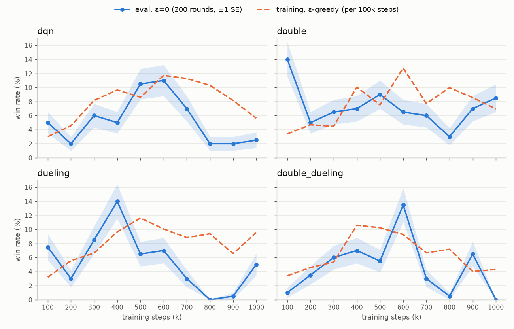
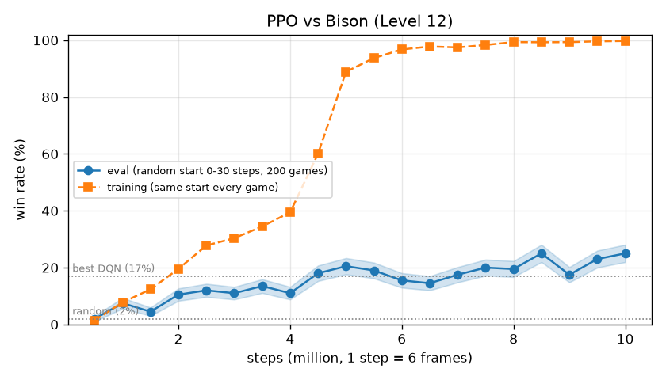

# DQN 4종 체크포인트 평가 (2026-10-08)

학습 로그를 보면 마지막 200판 승률이 dueling 8.5%, double 8.0%, dqn 7.5%, double_dueling 2.0%였다.
기법을 더할수록 오히려 나빠진 것처럼 보여서, 무작위 행동을 빼고 체크포인트마다 다시 재 보았다.

## 무엇을 했나

- 대상: `runs/{dqn,double,dueling,double_dueling}`의 `qnet_100000.pt` ~ `qnet_1000000.pt`, 모두 40개.
  네 학습 모두 하이퍼파라미터가 같고(100만 걸음, γ=0.94, lr 1e-4, 버퍼 10만, 동기화 1만 걸음), 시드는 하나씩이다.
- 방법: 체크포인트마다 200판, ε=0(무작위 행동 없음).
  에뮬레이터와 정책이 모두 결정적이라 그냥 돌리면 200판이 같은 판이 된다.
  그래서 판마다 처음 0~30걸음은 무작위 행동을 하게 했고, 체크포인트마다 서로 다른 결과가 165~170가지 나왔다.
- 실행: GPU 서버 6번 GPU, 프로세스 60개로 약 10분.

```bash
uv run python sf2/evaluate.py runs/dqn runs/double runs/dueling runs/double_dueling \
    --episodes 200 --workers 60 --device cuda --out runs/eval.csv
```

## 결과



파란 선이 평가 승률(띠는 ±1 표준오차, 약 ±2%p)이고, 주황 점선은 학습 중 ε-탐욕 승률을 10만 걸음 구간마다 평균한 값이다.
학습 초반(30만 걸음까지)은 ε이 커서 무작위 행동이 많다.

| 승률(%) | 10만~30만 | 40만~60만 | 70만~100만 | 가장 좋은 체크포인트 |
|:--|--:|--:|--:|:--|
| dqn | 4.3 | 8.8 | 3.4 | 60만 걸음, 11.0 |
| double | 8.5 | 7.5 | 6.1 | 10만 걸음, 14.0 |
| dueling | 6.3 | 9.2 | 2.1 | 40만 걸음, 14.0 |
| double_dueling | 3.5 | 8.7 | 2.5 | 60만 걸음, 13.5 |

## 읽은 것

**기법 사이의 순위는 이 데이터로 정할 수 없다.** 40만~60만 걸음 구간 승률은 7.5~9.2%로 네 학습이 거의 같다.
가장 좋은 체크포인트도 11~14%로 비슷하다. 40개 가운데 가장 큰 값을 고르면 운으로도 표준오차 두 배쯤은 위로 나온다.
그러니 double 10만 걸음의 14%(ε이 아직 0.7일 때 저장한 모델)도 진짜 실력이라기보다 운일 가능성이 크다.
학습 로그에서 double_dueling만 낮았던 2.0%는 마지막 구간의 흔들림이 겹친 결과로 보인다.

**네 학습 모두 40만~60만 걸음에서 가장 좋고, 그 뒤로 나빠진다.** 기법과 상관없이 같은 모양이다.
그래서 "기법을 더해서 나빠졌다"가 아니라 "이 설정으로 오래 학습하면 나빠진다"가 맞는 설명이다.
ε은 30만 걸음에 0.05까지 내려가 그대로 머문다. 이후로는 버퍼(10만 걸음)에 거의 자기 정책이 만든 경험만 쌓인다.

**바로 옆 체크포인트끼리도 차이가 크다.** dueling은 40만 걸음 14% → 50만 걸음 6.5%, double_dueling은 60만 걸음 13.5% → 70만 걸음 3%이다.
표준오차(약 2%p)보다 훨씬 크게 움직이므로, 정책 자체가 10만 걸음 사이에도 크게 바뀐다는 뜻이다.
"마지막 체크포인트 = 가장 좋은 모델"이 아니다.

**학습 후반에는 무작위 행동 5%가 오히려 도움이 된다.** 70만~100만 걸음 구간에서 평가 승률(ε=0)은 2~6%이고,
같은 구간 학습 승률(ε=0.05)은 4~11%로 대체로 더 높다. 보상도 비슷한 차이를 보인다.
학습 중 보상은 0.15 안팎으로 유지되지만, ε=0 평가에서는 dueling·double_dueling의 판당 보상이
60만 걸음 0.09~0.15에서 100만 걸음 −0.04까지 떨어진다.
탐욕 정책이 같은 행동을 반복하는 패턴에 빠지고 상대 CPU가 그것을 받아치는데, 가끔 섞이는 무작위 행동이 그 반복을 끊어 주는 것으로 보인다.
행동 분포는 기록하지 않았으므로 아직 가설이다.

이전에 "보상(준 피해 위주)과 승리가 어긋나서"라고 설명했는데, ε=0 평가에서는 보상도 같이 떨어졌다.
그러니 그 어긋남만으로는 후반 하락을 설명하지 못한다.
γ=0.94로는 앞을 약 17걸음만 내다보므로 승패 보상이 거의 반영되지 않는다는 점은 여전히 사실이지만, 주원인이라고 하기는 어렵다.

## 다음에 해볼 것

1. 평가할 때 행동 분포를 기록한다. 후반 체크포인트가 특정 행동 몇 개만 반복하는지 확인한다.
2. 같은 체크포인트를 ε=0.05로도 평가해 ε=0과 비교한다. 무작위 행동이 승률을 올리는지 직접 확인한다.
3. 학습 중 5만~10만 걸음마다 ε=0 평가를 돌려 가장 좋은 모델을 따로 저장한다(`qnet_best.pt`).
4. 기법을 비교하려면 시드를 3개 이상 돌린다. 시드 하나로는 지금처럼 흔들림이 차이를 덮는다.
5. 후반 붕괴를 줄일 후보로는 lr 낮추기(1e-4 → 5e-5), 목표 신경망 동기화 늘리기(1만 → 3만 걸음), γ 올리기(0.94 → 0.99)를 하나씩 바꿔 본다.

원자료는 `runs/eval.csv`(체크포인트 × 판 8,000줄)이고, `runs/`는 git에 올리지 않는다.

## 추가 실험: 학습률 줄이기와 가장 좋은 모델 저장 (2026-10-08 오후)

`--lr-end 1e-5 --eval-interval 50000`으로 네 학습을 다시 돌렸다(`runs/*_lrdecay`).
학습률은 1e-4에서 1e-5까지 직선으로 줄였고, 나머지 설정은 위 실험과 같다.
체크포인트 80개(5만 걸음 간격)를 위와 같은 방식(200판, ε=0, 처음 0~30걸음 무작위)으로 다시 평가했다.

| 승률(%) | 40만~60만 (이전 → 이번) | 70만~100만 (이전 → 이번) | 100만 걸음 모델 (이전 → 이번) |
|:--|--:|--:|--:|
| dqn | 8.8 → 7.7 | 3.4 → 8.4 | 2.5 → 7.5 |
| double | 7.5 → 7.0 | 6.1 → 9.8 | 8.5 → 8.5 |
| dueling | 9.2 → 7.8 | 2.1 → 13.1 | 5.0 → 16.5 |
| double_dueling | 8.7 → 10.6 | 2.5 → 15.6 | 0.0 → 17.0 |

**후반 하락이 사라졌다.** 40만~60만 걸음 구간은 이전과 비슷하지만, 70만 걸음 이후에 떨어지지 않고 오히려 오른다.
Dueling을 쓴 두 학습에서 효과가 가장 커서, 70만~100만 걸음 평균이 2%대에서 13~16%가 되었다.
이번에는 마지막 모델이 가장 좋은 축에 든다. 앞에서 본 하락은 학습률이 후반까지 커서 정책이 흔들린 탓이 컸다는 뜻이다.

**학습 중 평가로 고른 `qnet_best.pt`는 믿기 어렵다.** 학습 중에는 100판·ε=0.05로 20번 평가해 가장 높은 것을 골랐다.
그런데 고른 체크포인트를 200판·ε=0으로 다시 재면 3.5~13.5%로, 학습 중에 잰 15~23%보다 낮다.
100판은 표준오차가 3~4%p라 20번 중 가장 높은 값은 운으로 부풀기 쉽다. 고를 때는 판 수를 늘리거나 가까운 체크포인트 몇 개를 평균해야 한다.

**Adam eps 1.5e-4는 쓰면 안 된다.** 처음에는 Rainbow를 따라 eps도 1.5e-4로 바꿨는데, 40만 걸음까지 네 학습 모두 거의 배우지 못했다.
보상에 0.001을 곱하는 이 환경은 그래디언트 크기가 1e-6 수준이라 eps가 분모를 차지해 학습 폭이 약 1/100로 줄었다.
이 학습은 40만 걸음에서 멈췄고 기록은 서버 `runs/*_stable_adameps`에 있다.

다음 후보는 n-step 수익과 γ 올리기(리서치 3번)다. 지금도 100만 걸음에서 오르는 중이므로 200만 걸음까지 늘려 보는 것도 같이 볼 만하다.

## 행동 분포 (2026-10-08 저녁)

100만 걸음 모델 8개를 200판씩(ε=0) 돌려, 모델이 고른 행동을 셌다(`runs/eval_actions_actions.csv`).
기준으로 완전 무작위 행동도 200판 돌렸다(승률 2.0%, 진 판에서 베가에게 남은 체력 107/176).

| 모델 | 승률 | 직전과 같은 행동 | 가장 많이 고른 행동 |
|:--|--:|--:|:--|
| dueling (학습률 고정) | 4.0% | 87% | ↓+C 다리 걸기 92% |
| double_dueling (학습률 고정) | 1.0% | 84% | B 중킥 89% |
| dqn (학습률 고정) | 0.5% | 33% | A 약킥 26%, C 강킥 22% |
| double (학습률 고정) | 6.5% | 35% | ↗ 점프 29%, ↖ 점프 19% |
| dueling_lrdecay | 15.5% | 35% | ↗ 점프 40%, C 강킥 26% |
| double_dueling_lrdecay | 15.0% | 17% | 고르게 퍼짐(가장 많은 것이 ↑ 13%) |
| double_lrdecay | 14.0% | 16% | 고르게 퍼짐(가장 많은 것이 ↘ 9%) |
| dqn_lrdecay | 8.5% | 14% | 고르게 퍼짐(가장 많은 것이 ↓+Z 9%) |

**학습률을 고정했을 때의 후반 붕괴는 "한 기술만 반복하기"였다.** Dueling 두 모델은 행동의 90% 가까이를 기술 하나에 썼다.
앞에서 가설로 둔 "같은 행동을 반복하다 상대에게 읽힌다"가 맞았다.
학습률을 줄인 모델은 이렇게 쏠리지 않고, dueling_lrdecay만 점프와 강킥을 섞는 "점프 킥" 위주다.

**이긴 판과 진 판의 행동 분포가 거의 같다.** 이길 때 쓰는 전략이 따로 있는 게 아니라, 같은 방식으로 싸우다 상황이 맞으면 이기는 것이다.
진 판에서 베가에게 남은 체력은 76~82(학습률 감소 모델)로, 무작위(107)보다 피해를 30% 정도 더 준다.

필살기(파동권 등)는 행동 목록에 없고, ↓ → ↘ → → → 펀치를 여러 걸음에 걸쳐 차례로 골라야 나온다. 지금 탐색 방식으로는 거의 발견할 수 없다.

## PPO (2026-10-10)

참고 프로젝트의 `train.py`와 같은 설정으로 PPO를 1,000만 걸음 학습했다(`sf2/ppo.py`).
stable-baselines3 PPO + CnnPolicy, 환경 16개, 행동은 버튼 12개를 따로 누르는 `MultiBinary(12)`,
n_steps 512, batch 512, epoch 4, γ 0.94, 학습률 2.5e-4 → 2.5e-6, 클리핑 범위 0.15 → 0.025.
GPU 6번에서 초당 약 2,200걸음, 1시간 15분 걸렸다. DQN(100만 걸음)보다 데이터를 10배 썼다.

체크포인트 20개(50만 걸음 간격)를 DQN과 같은 방식(200판, 처음 0~30걸음 무작위)으로 평가했다(`sf2/evaluate_ppo.py`).
행동은 정책에서 확률대로 뽑았다.

```bash
uv run python sf2/evaluate_ppo.py runs/ppo --episodes 200 --workers 60 --out runs/eval_ppo.csv
```



| 걸음 | 100만 | 250만 | 500만 | 750만 | 1,000만 |
|:--|--:|--:|--:|--:|--:|
| 학습 중 승률(직전 50만 걸음) | 7.8% | 27.8% | 88.9% | 98.3% | 99.7% |
| 평가 승률(무작위 시작) | 7.5% | 12.0% | 20.5% | 20.0% | 25.0% |

**학습 중에는 거의 다 이기지만, 그것은 한 판을 외운 결과다.** 학습 승률은 400만 걸음 근처에서 급히 올라 507만 걸음부터는 100판 연속으로 이긴다.
그런데 무작위 시작 없이 마지막 모델을 100판 돌리면 100판 모두 이기고 보상도 매번 0.978로 똑같다.
결정적으로 행동을 골라도 같다. 에뮬레이터가 결정적이라 학습할 때 매 판이 같은 상황에서 시작하므로,
그 상황에서 이기는 행동 순서 하나를 익힌 것이다. 판 길이도 230걸음 안팎에서 71걸음으로 줄었다.
마지막 50만 걸음의 7,056판에서 나온 서로 다른 보상 값은 42가지뿐이다.

**처음 몇 걸음만 흔들어도 승률은 25%로 떨어진다.** 외운 경로를 벗어나면 대처하지 못한다.
경로 밖에서는 버튼마다 누를 확률이 0.3~0.6에 머물러, 정책이 아직 많이 흐릿하다.
참고 프로젝트 README가 200만~300만 걸음 뒤로는 "첫 라운드에 과적합한다"고 한 것과 같은 현상이다.

**그래도 무작위 시작 평가에서 DQN보다 낫다.** 평가 승률은 학습 내내 조금씩 올라 1,000만 걸음에서 25%다.
DQN의 가장 좋은 결과(학습률 감소, 100만 걸음, 17%)보다 높다. 다만 같은 100만 걸음에서는 PPO도 7.5%로 DQN과 비슷하다.
학습 중에 외운 경로가 일부는 일반화된 것으로 보인다. 진 판에서 베가에게 남은 체력은 80 안팎으로 DQN(76~82)과 비슷하다.

**운영 메모.** 학습이 끝난 뒤 정리용 스크립트가 `tmux kill-session -t ppo`를 실행했는데,
`ppo` 세션이 이미 닫혀 있어 tmux가 이름 앞부분이 같은 `ppo_post` 세션(스크립트 자신)을 종료했다. 평가는 손으로 다시 돌렸다.
세션 이름은 `-t =ppo`처럼 정확히 맞춰 지정해야 한다.

### 다음에 해볼 것

1. 학습할 때도 판마다 처음 0~30걸음을 무작위로 움직이거나, 시작 저장 상태를 여러 개 섞는다. 한 판을 외우는 길을 막는다.
2. 평가 승률이 아직 오르는 중이므로, 1번을 넣은 뒤에 학습을 더 길게(참고 프로젝트처럼 1억 걸음) 돌려 본다.
3. 학습률·클리핑 범위가 전체 걸음 수에 맞춰 줄어드므로, 1,000만 걸음 학습의 250만 걸음 모델은 1억 걸음 학습의 같은 지점과 다르다. 비교할 때 이 차이를 감안한다.

원자료는 `runs/eval_ppo.csv`, 버튼을 누른 비율은 `runs/eval_ppo_buttons.csv`, 학습 기록은 `runs/ppo/episodes.csv`다.
